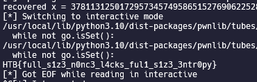

# Cyber Apocalypse 2023

## Biased Heritage

> You emerge from the labyrinth to find a massive door blocking your path to the relic. It has the same authentication mechanism as the entrance, but it appears to be more sophisticated and challenging to crack. Can you devise a plan to breach the door and gain access to the relic?
>
>  README Author: [ch0vid99](chovid99.github.io)
>
> [`crypto_biased_heritage.zip`](crypto_biased_heritage.zip)

## Initial Analysis
This is the upgraded challenge from the previous challenge (Colliding Heritage). Let’s try to see the given server.py
```
#!/usr/bin/env python3

import signal
from secrets import randbelow
from hashlib import sha256
from Crypto.Util.number import isPrime, getPrime, long_to_bytes, bytes_to_long

FLAG = "HTB{???????????????????????????????????????}"


class SHA256chnorr:

    def __init__(self):
        # while True:
        #     self.q = getPrime(512)
        #     self.p = 2*self.q + 1
        #     if isPrime(self.p):
        #         break
        self.p = 0x184e26a581fca2893b2096528eb6103ac03f60b023e1284ebda3ab24ad9a9fe0e37b33eeecc4b3c3b9e50832fd856e9889f6c9a10cde54ee798a7c383d0d8d2c3
        self.q = (self.p - 1) // 2
        self.g = 3
        self.x = randbelow(self.q)
        self.y = pow(self.g, self.x, self.p)

    def H(self, msg):
        return bytes_to_long(2 * sha256(msg).digest()) % self.q

    def sign(self, msg):
        k = self.H(msg + long_to_bytes(self.x))
        r = pow(self.g, k, self.p) % self.q
        e = self.H(long_to_bytes(r) + msg)
        s = (k - self.x * e) % self.q
        return (s, e)

    def verify(self, msg, sig):
        s, e = sig
        if not (0 < s < self.q):
            return False
        if not (0 < e < self.q):
            return False
        rv = pow(self.g, s, self.p) * pow(self.y, e, self.p) % self.p % self.q
        ev = self.H(long_to_bytes(rv) + msg)
        return ev == e


def menu():
    print('[S]ign a message')
    print('[V]erify a signature')
    return input('> ').upper()[0]


def main():
    sha256chnorr = SHA256chnorr()
    print('g:', sha256chnorr.g)
    print('y:', sha256chnorr.y)
    print('p:', sha256chnorr.p)

    for _ in range(3):
        choice = menu()

        if choice == 'S':
            msg = bytes.fromhex(input('Enter message> '))
            if b'right hand' in msg:
                print('No!')
            else:
                sig = sha256chnorr.sign(msg)
                print('Signature:', sig)

        elif choice == 'V':
            msg = bytes.fromhex(input('Enter message> '))
            s = int(input('Enter s> '))
            e = int(input('Enter e> '))
            if sha256chnorr.verify(msg, (s, e)):
                if msg == b'right hand':
                    print(FLAG)
                else:
                    print('Valid signature!')
            else:
                print('Invalid signature!')

        else:
            print('Invalid choice...')


if __name__ == '__main__':
    signal.alarm(30)
    main()
```

As you can see, the generation of k is changed. Now, it uses sha256 instead of md5. Up until now, there isn’t any collision found for sha256, which mean we can’t use our previous approach to solve this challenge.

## Solution
Reading through the wikipedia again, it mentions that:
```
In fact, even slight biases in the value k or partial leakage of k can reveal the private key, after collecting sufficiently many signatures and solving the hidden number problem.
```

So, there is another method to recover private key x with restriction that the generation of k is weak so that it has biases. Now, let’s try to check again the new generation method of k.

```
def H(self, msg):
    return bytes_to_long(2 * sha256(msg).digest()) % self.q

def sign(self, msg):
    k = self.H(msg + long_to_bytes(self.x))
    r = pow(self.g, k, self.p) % self.q
    e = self.H(long_to_bytes(r) + msg)
    s = (k - self.x * e) % self.q
    return (s, e)
```
Notice that generation of k (nonce) is now 2 * sha256(msg || x). This is actually a weak generation. Notice that even though the size of the k is around 512 bits, the k contains repeated sequence of bits. The entropy is only 256 bits due to the repetition. This means, the k can be constructed like below:
$$
k = 2^{256}b + b \\
k = b(2^{256} + 1) \\
$$
where $b$ is the 256 bits produced by the sha256 hashing algorithm. That means there is indeed biases in the generated k, and we might be able to recover it.
This paper and writeup helps me a lot on understanding how to approach this problem. Basically, notice that the way of Schnorr signature mechanism is actually similar to a hidden number problem. Putting the above knowledge on how the k is generated to the signature mechanism will produce a new equation.
$$
\begin{align}
s = k - xe \mod q \\
s = b(2^{256}+1) - xe \mod q \\
s - b(2^{256}+1) + xe = 0 \mod q \\
\end{align}
$$
where $b$ value is actually smalled compared to the other value.
Usually, on this kind of setup, we can construct a lattice and use LLL to recover a unknown value that we have on the above equation. I recommend you to read the writeup that I mentioned above to understand the detail of how lattice works, but basically I came up with this lattice after reading through the previous paper and writeup.
$$
M =
\begin{bmatrix}
1 & 0 & 0 & 0 & s_2 & s_1 \\
0 & 2/q & 0 & 0 & e_2 & e_1 \\
0 & 0 & 1/B & 0 & (B+1) & 0 \\
0 & 0 & 0 & 1/B & 0 & (B+1) \\
0 & 0 & 0 & 0 & q & 0 \\
0 & 0 & 0 & 0 & 0 & q \\
\end{bmatrix}
$$
where $B = 2^{256}$ ($B$ is bound of the b value that we’re trying to recover). It is the same like previous challenge, where we can only retrieve two signatures from the server, which is why the lattice only contains signature 1 and 2.
Using that lattice, we hope that that there exist a vector in the lattice that is small, which is like below:
$$
\begin{pmatrix}
1 & \frac{2x}{q} & \frac{-b_2}{B} & \frac{-b_1}{B} & 0 & 0
\end{pmatrix}
$$
And because $x$, $q$, $b_2$, $B$, $b_1$ bits length is pretty much the same or close, we hope that the above vector is small enough to the lattice. To find that target vector, we can assume that if we’re trying to look for a vector in the lattice that is close to the below vector,
$$
\begin{pmatrix}
1 & 1 & -1 & -1 & 0 & 0
\end{pmatrix}
$$
we will find our target vector. To find the approximation of it, we can use Babai CVP algorithm.
If we find the targeted vector, that means we have successfully recovered the private key x, and the rest of the steps are the same as the previous challenge.
Below is my full script (sage script). Notes that due to the lack of signature that we can collect (only 2), the script success rate is not 100%, so you might need to re-run the script for multiple times.

```
from secrets import randbelow
from hashlib import sha256
from Crypto.Util.number import isPrime, getPrime, long_to_bytes, bytes_to_long
from pwn import *
import os

'''
def H(self, msg):
    return bytes_to_long(2 * sha256(msg).digest()) % self.q

Notice that the k generation is:
- k = self.H(msg + long_to_bytes(self.x))

The Hash message is weak, because that means:
k = b + 2^256*b = b(2^256+1)
where b is the 256 bits generated by the sha256, and it is small enough compared to q

This means, we can try to recover it by constructing a lattice that
can produced a vector containing the b value after being reduced
by LLL algorithm.
'''

def Babai_closest_vector(B, target):
    # Babai's Nearest Plane algorithm
    M = B.LLL()
    G = M.gram_schmidt()[0]
    small = target
    for _ in range(1):
        for i in reversed(range(M.nrows())):
            c = ((small * G[i]) / (G[i] * G[i])).round()
            small -= M[i] * c
    return target - small

p = 0x184e26a581fca2893b2096528eb6103ac03f60b023e1284ebda3ab24ad9a9fe0e37b33eeecc4b3c3b9e50832fd856e9889f6c9a10cde54ee798a7c383d0d8d2c3
q = (p - 1) // 2
g = 3

msg1 = os.urandom(16)
msg2 = os.urandom(16)

io = remote(b'206.189.112.129', int(30481))
io.recvuntil(b': ')
g = int(io.recvline())
io.recvuntil(b': ')
y = int(io.recvline())
io.recvuntil(b': ')
p = int(io.recvline())
q = int((p-1)//2)

io.sendlineafter(b'> ', b'S')
io.sendlineafter(b'> ', msg1.hex().encode())
io.recvuntil(b': ')
s1, e1 = eval(io.recvline())
io.sendlineafter(b'> ', b'S')
io.sendlineafter(b'> ', msg2.hex().encode())
io.recvuntil(b': ')
s2, e2 = eval(io.recvline())

B = 2**256 # b_i = (2^256 + 1)*b_i), and b_i bound is 2**256 because it is the result of sha256
M = Matrix([
    [1, 0, 0, 0, s2,   s1],
    [0, 2/q, 0, 0, e2,   e1],
    [0, 0, 1/B, 0, (B+1), 0],
    [0, 0, 0, 1/B, 0, (B+1)],
    [0, 0, 0, 0, q,     0],
    [0, 0, 0, 0, 0,     q],
])

# Try to find a vector resides in the lattice which is close to the
# target vector
res = Babai_closest_vector(M, vector([1, 1, -1, -1, 0, 0]))
x = int(res[1]*q/2) - 1 # Based on observation, if we're lucky, our recovered x is differed by 1
print(f'recovered x = {x}')

# Sign the message with our recovered private key
msg = b'right hand'
def H(msg):
    return bytes_to_long(2 * sha256(msg).digest()) % q
k = H(msg + long_to_bytes(x))
r = pow(int(g), int(k), int(p)) % q
e = H(long_to_bytes(r) + msg)
s = (k - x * e) % q

io.sendlineafter(b'> ', b'V')
io.sendlineafter(b'> ', msg.hex().encode())
io.sendlineafter(b'> ', str(s).encode())
io.sendlineafter(b'> ', str(e).encode())
io.interactive()
```


## Flag
HTB{full_s1z3_n0nc3_l4cks_ful1_s1z3_3ntr0py}