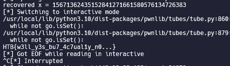

# Cyber Apocalypse 2023

## Colliding Heritage

> As you arrive at the location of the relic, you discover an ancient tomb that appears to have no visible entrance. However, a scan of the area reveals the presence of unusual RF signals coming from a specific location. With the help of your team, you manage to create an interface to communicate with the signal-emitting device. Unfortunately, the device only grants access to descendants of the pharaoh's left hand. Can you find a way to enter the tomb?
>
>  README Author: [ch0vid99](chovid99.github.io)
>
> [`crypto_colliding_heritage.zip`](crypto_colliding_heritage.zip)

## Initial Analysis

For this challenge, we were given a file called server.py. Below is the code of it:

```
#!/usr/bin/env python3

import signal
from secrets import randbelow
from hashlib import md5
from Crypto.Util.number import isPrime, getPrime, long_to_bytes, bytes_to_long

FLAG = "HTB{???????????????????????????}"


class MD5chnorr:

    def __init__(self):
        # while True:
        #     self.q = getPrime(128)
        #     self.p = 2*self.q + 1
        #     if isPrime(self.p):
        #         break
        self.p = 0x16dd987483c08aefa88f28147702e51eb
        self.q = (self.p - 1) // 2
        self.g = 3
        self.x = randbelow(self.q)
        self.y = pow(self.g, self.x, self.p)

    def H(self, msg):
        return bytes_to_long(md5(msg).digest()) % self.q

    def sign(self, msg):
        k = self.H(msg + long_to_bytes(self.x))
        print(f'{k = }')
        r = pow(self.g, k, self.p) % self.q
        e = self.H(long_to_bytes(r) + msg)
        s = (k - self.x * e) % self.q
        return (s, e)

    def verify(self, msg, sig):
        s, e = sig
        if not (0 < s < self.q):
            return False
        if not (0 < e < self.q):
            return False
        rv = pow(self.g, s, self.p) * pow(self.y, e, self.p) % self.p % self.q
        ev = self.H(long_to_bytes(rv) + msg)
        return ev == e


def menu():
    print('[S]ign a message')
    print('[V]erify a signature')
    return input('> ').upper()[0]


def main():
    md5chnorr = MD5chnorr()
    print('g:', md5chnorr.g)
    print('y:', md5chnorr.y)
    print('p:', md5chnorr.p)

    for _ in range(3):
        choice = menu()

        if choice == 'S':
            msg = bytes.fromhex(input('Enter message> '))
            if b'I am the left hand' in msg:
                print('No!')
            else:
                sig = md5chnorr.sign(msg)
                print('Signature:', sig)

        elif choice == 'V':
            msg = bytes.fromhex(input('Enter message> '))
            s = int(input('Enter s> '))
            e = int(input('Enter e> '))
            if md5chnorr.verify(msg, (s, e)):
                if msg == b'I am the left hand':
                    print(FLAG)
                else:
                    print('Valid signature!')
            else:
                print('Invalid signature!')

        else:
            print('Invalid choice...')


if __name__ == '__main__':
    signal.alarm(30)
    main()
```
So, we were given a server that implements a signature scheme with the Schnorr signature algorithm. The detail of the algorithm can be read in the [wikipedia](https://en.wikipedia.org/wiki/Schnorr_signature). The challenge will share the public key of the signature scheme (g, y, and p), and give us three chances only to use the available menus, which are:

S, which is a menu to sign any message that we provide.

There is a restriction where it isn’t allowed to contain the string I am the left hand.
We will get the s and e values as well, which is the signature.

V, which is a menu to validate our signature of the message.

If the signature is valid, and the message is I am the left hand, it will print the flag.

So, the target of this chall is with two signatures that we retrieve from the server, we need to be able to retrieve the private key so that we can sign the message I am the left hand, send it to the server, and retrieve the flag from the server.

## Solution

Notice that in this kind of signature scheme, the vulnerability usually lies in the way it generates the k (nonce) value. The k generation isn’t allowed to be weak, because it can be used to retrieve the private key (x).
As mentioned in the Wikipedia that I shared before, if a nonce reused is disallowed on this kind of signature scheme. The reason is that we can recover the private key (x) if we use the same k during signing two different messages. Let’s try to see the below signing equations to understand why we can recover k if it is being reused to sign different messages:
```
s_1 = (k - xe_1) mod q
s_2 = (k - xe_2) mod q 
```
If we subtract the above equation, then retrieving the $x$ becomes very easy because we know the value of $s_1$, $s_2$, $e_1$, $e_2$ and $q$. We can rearrange those two equations to retrieve the $x$.
```
(s_1 - s_2) = k - k - x(e_1e_2) mod q
x = -(s_1 - s_2)(e_1e_2)^{-1} mod q
```
So, if we sign two different messages with the same k, we will be able to recover x and sign the required message.
Now that we know that we need to somehow signing two different messages with the same k value, let’s take a look at how the k is generated.

```
  def H(self, msg):
      return bytes_to_long(md5(msg).digest()) % self.q

  def sign(self, msg):
      k = self.H(msg + long_to_bytes(self.x))
      print(f'{k = }')
      r = pow(self.g, k, self.p) % self.q
      e = self.H(long_to_bytes(r) + msg)
      s = (k - self.x * e) % self.q
      return (s, e)
```
Notice that the generation of k (nonce) is basically just doing md5(msg || x). As mentioned in a lot of articles, it is very easy to generate a hash collision with md5. Reading through this article helps me a lot to understand why the way this challenge generates k is weak. It is easy to generate md5 hash collision, which means we can sign two different messages with the same k value due to the collision.

Reading through that article, I realized that it is pretty simple to leverage the weakness of md5. We just need to grab two strings that have md5 collisions and use that as our messages to be signed. Be careful that because the msg that we send will be appended by the x as well, we can’t send the raw msg to the server. As mentioned in the previous article, during md5 hashing the msg, it pads the msg first with some bytes. So, we need to send the padded message to the server instead of raw msg to ensure that before the md5 process the bytes of appended x, both of the messages that we sent will have the same md5 state, so that when the md5 algorithm try to process the block of the appended x, the state will be the same, which mean it will produce the same hash.

After we’re able to produce the md5 collision, then based on the previous equations that I explained, we will be able to retrieve the private key x because the k value is reused.

Below is my full script to recover the flag (sage script):
```
from pwn import *
from hashlib import md5
from Crypto.Util.number import *

# Use two strings that has md5 collisions
m1 = bytes.fromhex('4dc968ff0ee35c209572d4777b721587d36fa7b21bdc56b74a3dc0783e7b9518afbfa200a8284bf36e8e4b55b35f427593d849676da0d1555d8360fb5f07fea2')
m2 = bytes.fromhex('4dc968ff0ee35c209572d4777b721587d36fa7b21bdc56b74a3dc0783e7b9518afbfa202a8284bf36e8e4b55b35f427593d849676da0d1d55d8360fb5f07fea2')
assert m1 != m2

'''
After we properly padding the above string to follow the specification of MD5,
(64-bytes per block), both of the string will produce the same state.
So, if you append any same string, the produced hash will still be the same.
#
In this case, k = HASH(m11 || x) == HASH(m22 || x) will be the same.
But, HASH(r || m11) != HASH(r || m22), because the 64-bytes block are different
#
So, if we sign this two message, it is basically the same case as re-used nonce k,
which is vulnerable. Notice this.
s2-s1 = k2-k1 - x(e2-e1)

If k2 == k1, that means:
x = -1 * (s2 - s1) * (e2-e1)^-1
'''
m11 = m1 + b"\x80" + b"\x00" * 55 + p64(0x200)
m22 = m2 + b"\x80" + b"\x00" * 55 + p64(0x200)

io = remote(b'142.93.35.133', int(31079))
io.recvuntil(b': ')

# Retrieve the public key
g = int(io.recvline())
io.recvuntil(b': ')
y = int(io.recvline())
io.recvuntil(b': ')
p = int(io.recvline())
q = int((p-1)//2)

# Sign the padded messages
io.sendlineafter(b'> ', b'S')
io.sendlineafter(b'> ', m11.hex().encode())
io.recvuntil(b': ')
s1, e1 = eval(io.recvline())
io.sendlineafter(b'> ', b'S')
io.sendlineafter(b'> ', m22.hex().encode())
io.recvuntil(b': ')
s2, e2 = eval(io.recvline())

# Recover x
x = (((s2-s1) * inverse_mod(e2-e1, q)) * -1) % q
print(f'recovered x = {x}')

# Sign the required message and send it to the server
msg = b'I am the left hand'
def H(msg):
    return bytes_to_long(md5(msg).digest()) % q
k = H(msg + long_to_bytes(x))
r = pow(int(g), int(k), int(p)) % q
e = H(long_to_bytes(r) + msg)
s = (k - x * e) % q

io.sendlineafter(b'> ', b'V')
io.sendlineafter(b'> ', msg.hex().encode())
io.sendlineafter(b'> ', str(s).encode())
io.sendlineafter(b'> ', str(e).encode())

io.interactive()
```


## Flag
HTB{w3ll_y3s_bu7_4c7ual1y_n0...}