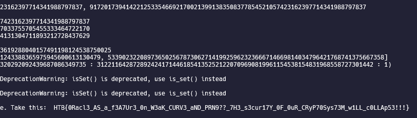

# Cyber Apocalypse 2023

## Converging Visions

> As you hold the relic in your hands, it prompts you to input a coordinate. The ancient scriptures you uncovered near the pharaoh's tomb reveal that the artifact is capable of transmitting the locations of vessels. The initial coordinate must be within proximity of the vessels, and an algorithm will then calculate their precise locations for transmission. However, you soon discover that the coordinates transmitted are not correct, and are encrypted using advanced alien techniques to prevent unauthorized access. It becomes clear that the true coordinates are hidden, serving only to authenticate those with knowledge of the artifact's secrets. Can you decipher this alien encryption and uncover the genuine coordinates to locate the vessels and destroy them?
>
>  README Author: [ch0vid99](chovid99.github.io)
>
> [`crypto_converging_visions.zip`](crypto_converging_visions.zip)

## Initial Analysis
On this challenge, we were given a file called server.py. Below is the contents of the code:

```
from secret import FLAG, p, a, b
from sage.all_cmdline import *


class PRNG:

    def __init__(self, p, mul1, mul2):
        self.mod = p * 6089788258325039501929073418355467714844813056959443481824909430411674443639248386564763122373451773381582660411059922334086996696436657009055324008041039
        self.exp = 2
        self.mul1 = mul1
        self.mul2 = mul2
        self.inc = int.from_bytes(b'Coordinates lost in space', 'big')
        self.seed = randint(2, self.mod - 1)

    def rotate(self):
        self.seed = (self.mul1 * pow(self.seed, 3) + self.mul2 * self.seed +
                     self.inc) % self.mod
        return self.seed, pow(self.seed, self.exp, self.mod)


class Relic:

    def __init__(self, p, a, b):
        self.E = EllipticCurve(GF(p), [a, b])
        self.P = None
        self.EP = None
        self.p = p
        self.prng = PRNG(p, a, b)

    def setupPoints(self, x):
        if x >= self.p:
            return 'Coordinate greater than curve modulus'

        try:
            self.P = self.E.lift_x(Integer(x))
            self.EP = self.P
        except:
            return 'Point not on curve'

        return ('Point confirmed on curve', self.P[0], self.P[1])

    def nextPoints(self):
        seed, enc_seed = self.prng.rotate()
        self.P *= seed
        self.EP *= enc_seed
        return ('New Points', self.EP[0], self.EP[1], self.P[0], self.P[1])


def menu():
    print('Options:\n')
    print('1. Setup Point')
    print('2. Receive new point')
    print('3. Find true point')
    option = input('> ')
    return option


def main():
    artifact = Relic(p, a, b)
    setup = False
    while True:
        try:
            option = menu()
            if option == '1':
                print('Enter x coordinate')
                x = int(input('x: '))
                response = artifact.setupPoints(x)
                if response[0] == 'Point confirmed on curve':
                    setup = True
                print(response)
            elif option == '2':
                if setup:
                    response = artifact.nextPoints()
                    print('Response')
                    print((response[0], response[1], response[2]))
                else:
                    print('Configure origin point first')
            elif option == '3':
                if setup:
                    print('Input x,y')
                    Px = int(input('x: '))
                    Py = int(input('y: '))
                    response = artifact.nextPoints()
                    if response[3] == Px and response[4] == Py:
                        print(
                            'You have confirmed the location. It\'s dangerous however to go alone. Take this: ',
                            FLAG)
                    else:
                        print('The vessels will never be found...')
                    exit()
                else:
                    print('Configure origin point first')
            else:
                print("Invalid option, sutting down")
                exit()
        except Exception as e:
            response = f'An error occured: {e}'
            print(response)
            exit()


if __name__ == '__main__':
    assert p.bit_length() == 256
    main()
```

As we can see in the code, the server is basically a combination of Elliptic Curve and PRNG. Let’s check the PRNG code first.

```
class PRNG:

    def __init__(self, p, mul1, mul2):
        self.mod = p * 6089788258325039501929073418355467714844813056959443481824909430411674443639248386564763122373451773381582660411059922334086996696436657009055324008041039
        self.exp = 2
        self.mul1 = mul1
        self.mul2 = mul2
        self.inc = int.from_bytes(b'Coordinates lost in space', 'big')
        self.seed = randint(2, self.mod - 1)

    def rotate(self):
        self.seed = (self.mul1 * pow(self.seed, 3) + self.mul2 * self.seed +
                     self.inc) % self.mod
        return self.seed, pow(self.seed, self.exp, self.mod)
```

Well, this is just a usual PRNG, with an extra that it doesn’t only return the seed, but also the encrypted seed (encrypted with scheme similar to RSA rabin, which is $enc = \text{seed}^2 \mod (p\*c)$, where $c$ is the constant hard-coded in the code).
Now, let’s try to check the ECC class:

```
class Relic:

    def __init__(self, p, a, b):
        self.E = EllipticCurve(GF(p), [a, b])
        self.P = None
        self.EP = None
        self.p = p
        self.prng = PRNG(p, a, b)

    def setupPoints(self, x):
        if x >= self.p:
            return 'Coordinate greater than curve modulus'

        try:
            self.P = self.E.lift_x(Integer(x))
            self.EP = self.P
        except:
            return 'Point not on curve'

        return ('Point confirmed on curve', self.P[0], self.P[1])

    def nextPoints(self):
        seed, enc_seed = self.prng.rotate()
        self.P *= seed
        self.EP *= enc_seed
        return ('New Points', self.EP[0], self.EP[1], self.P[0], self.P[1])
```
Okay, so the summary is:

The Relic is using the PRNG class as one of its attribute
It also has two variable to store points, which are P and EP
There are two main method:
setupPoints
This will reset the Relic point to our chosen x, where the x is required to be a valid point.
This will reset both the P and EP value to store our chosen point.
nextPoints
This will generate a new random number from the prng, and then multiply the:
P with seed
EP with enc_seed
There are three menus that we can interact with, which are:

1 to re-setup the points that will be used by the Elliptic Curve.
If the given x is larger than the used p, it will return a message Coordinate greater than curve modulus.
Else, it will try to generate a point (x, y) on the curve and return it to us if it is valid.
2 to generate a new points, which is:
P \*= seed
EP \*= enc_seed
where EP is basically the current point set in the Elliptic Curve multiplied with the encrypted seed.
And then it will return only the EP to us.
3 to print the flag, with restriction that we need to be able to predict the generated point by nextPoints method.
Based on that info, we can deduce that the target is we need to be able recover the seed value, and then use it to generate our prediction of the nextPoints.

## Solution

First of all, we don’t know the parameter of the curve yet (p, a, b). So, we need to recover that first. Notice that in the first menu, we can actually do binary search to find the p value, because if we give x bigger than the p, the program will let us know that the x is bigger than the p value.

After recovering the p value, it is easy to recover the a and b value. We just need to generate two points, and then subtract it just like what we did in the Elliptic Labyrinth Challenge. Below is the script that I used to recover the params (I use sagemath).

```
from pwn import *

r = remote('68.183.37.122', int(32073))

# Binary Search the p. I've changed the high and low value in here to speed up the process as
# I've already retrieved the value before making this writeup.
high = 91720173941422125335466921700213991383508377854521057423162397714341988797840
low = 91720173941422125335466921700213991383508377854521057423162397714341988797837

while high - low >= 0:
    print(f'high, low = {high}, {low}')
    print(f'Curr diff: {high - low}')
    if high - low == 0:
        break
    mid = (high + low) // 2
    r.sendlineafter(b'> ', b'1')
    r.sendlineafter(b'x: ', str(mid).encode())
    out = r.recvline()
    if b'greater' in out:
        # Too high
        high = mid
    else:
        low = mid + 1
p = high
print(f'recovered p = {p}')

def setup_point(x):
    r.sendlineafter(b'> ', b'1')
    r.sendlineafter(b'x: ', str(x).encode())
    _, x1, y1 = eval(r.recvline().strip())
    return x1, y1

x1, y1 = setup_point(4)
x2, y2 = setup_point(6)
a = (((y1^2 - y2^2) - (x1^3 -x2^3))*inverse_mod(x1-x2, p)) % p
b = (y1^2 - x1^3 - a*x1) % p
print(f'recovered a = {a}')
print(f'recovered b = {b}')

E = EllipticCurve(GF(p), [a, b])
```
After we finally recovered the curve, it’s time to move to the next step, which is figuring out how to recover the PRNG seed.
In ECC, discrete logarithm is hard. So, if we have equation like $A = kB$ where $A$ and $B$ is point, $k$ is the multiplier, and we only know $A$ and $B$, we won’t be able to recover the $k$ value easily. However for this challenge, in order to recover the seed value, we need to retrieve the enc_seed first.
Even though we can setup the point (let’s called it A) via the first menu, and we can also get the EP value, which is EP = enc_seed\*A, if the ECC is not weak, it won’t be possible for us to recover the enc_seed.
However, after playing around with the curve, I notice that the curve order is actually the same with the p used in the curve.
```
sage: E.order()
91720173941422125335466921700213991383508377854521057423162397714341988797837
sage: E.order() == p
True
```
This is a weak curve which is vulnerable to Smart Attack. Below is the script that I used to do the Smart Attack, taken from this [github](https://github.com/jvdsn/crypto-attacks/blob/master/attacks/ecc/smart_attack.py):
```
# Lifts a point to the p-adic numbers.
def _lift(E, P, gf):
    x, y = map(ZZ, P.xy())
    for point_ in E.lift_x(x, all=True):
        _, y_ = map(gf, point_.xy())
        if y == y_:
            return point_

def attack(G, P):
    """
    Solves the discrete logarithm problem using Smart's attack.
    More information: Smart N. P., "The discrete logarithm problem on elliptic curves of trace one"
    :param G: the base point
    :param P: the point multiplication result
    :return: l such that l * G == P
    """
    E = G.curve()
    gf = E.base_ring()
    p = gf.order()
    assert E.trace_of_frobenius() == 1, f"Curve should have trace of Frobenius = 1."

    E = EllipticCurve(Qp(p), [int(a) + p * ZZ.random_element(1, p) for a in E.a_invariants()])
    G = p * _lift(E, G, gf)
    P = p * _lift(E, P, gf)
    Gx, Gy = G.xy()
    Px, Py = P.xy()
    return int(gf((Px / Py) / (Gx / Gy)))

gx, gy = setup_point(4)
G = E(gx, gy)

def next_point():
    r.sendlineafter(b'> ', b'2')
    if args.LOCAL:
        print(r.recvline().strip())
    r.recvline().strip()
    _, x, y = eval(r.recvline().strip())
    return x, y

px, py = next_point()
P = E(px, py)
enc_seed = attack(G, P)
print(f'recovered enc_seed: {enc_seed}') # enc_seed = seed^2 mod p
```
By using the Smart attack, we will be able to recover the enc_seed, and now it’s time to move to the next part, which is recovering the seed from the known enc_seed.

To retrieve the seed, it is actually easy. Sagemath has a built-in feature that can calculate the nth_root of an integer over a ring. So, we just need to use that, and there will be two roots that is recovered. One of the two roots are the seed. With 50:50 chance, I decided to always took the second root as the seed, and then use it to predict the next point in the server. After that, we will be able to get our flag.

Below is the full script that I used to solve the challenge (I use sagemath).
```
from pwn import *

r = remote('68.183.37.122', int(32073))

p = None

if p is None:
    # Binary Search the p. I've changed the high and low value in here to speed up the process as
    # I've already retrieved the value before making this writeup.
    high = 91720173941422125335466921700213991383508377854521057423162397714341988797840
    low = 91720173941422125335466921700213991383508377854521057423162397714341988797837

    while high - low >= 0:
        print(f'high, low = {high}, {low}')
        print(f'Curr diff: {high - low}')
        if high - low == 0:
            break
        mid = (high + low) // 2
        r.sendlineafter(b'> ', b'1')
        r.sendlineafter(b'x: ', str(mid).encode())
        out = r.recvline()
        if b'greater' in out:
            # Too high
            high = mid
        else:
            low = mid + 1
    p = high
    print(f'recovered p = {p}')

a = None
b = None

def setup_point(x):
    r.sendlineafter(b'> ', b'1')
    r.sendlineafter(b'x: ', str(x).encode())
    _, x1, y1 = eval(r.recvline().strip())
    return x1, y1

if a is None or b is None:
    x1, y1 = setup_point(4)
    x2, y2 = setup_point(6)
    a = (((y1^2 - y2^2) - (x1^3 -x2^3))*inverse_mod(x1-x2, p)) % p
    b = (y1^2 - x1^3 - a*x1) % p
    print(f'recovered a = {a}')
    print(f'recovered b = {b}')

# Now that we have recovered the curves parameter build the curve
E = EllipticCurve(GF(p), [a, b])
print(f'Vulnerable to smart attack: {E.order() == p}')
assert E.order() == p # Vulnerable to Smart Attack

# Lifts a point to the p-adic numbers.
def _lift(E, P, gf):
    x, y = map(ZZ, P.xy())
    for point_ in E.lift_x(x, all=True):
        _, y_ = map(gf, point_.xy())
        if y == y_:
            return point_

def attack(G, P):
    """
    Solves the discrete logarithm problem using Smart's attack.
    More information: Smart N. P., "The discrete logarithm problem on elliptic curves of trace one"
    :param G: the base point
    :param P: the point multiplication result
    :return: l such that l * G == P
    """
    E = G.curve()
    gf = E.base_ring()
    p = gf.order()
    assert E.trace_of_frobenius() == 1, f"Curve should have trace of Frobenius = 1."

    E = EllipticCurve(Qp(p), [int(a) + p * ZZ.random_element(1, p) for a in E.a_invariants()])
    G = p * _lift(E, G, gf)
    P = p * _lift(E, P, gf)
    Gx, Gy = G.xy()
    Px, Py = P.xy()
    return int(gf((Px / Py) / (Gx / Gy)))

gx, gy = setup_point(4)
G = E(gx, gy)

def next_point():
    r.sendlineafter(b'> ', b'2')
    if args.LOCAL:
        print(r.recvline().strip())
    r.recvline().strip()
    _, x, y = eval(r.recvline().strip())
    return x, y

px, py = next_point()
P = E(px, py)
enc_seed = attack(G, P)
print(f'recovered enc_seed: {enc_seed}') # enc_seed = seed^2 mod p

inc = int.from_bytes(b"Coordinates lost in space", "big")
Z = IntegerModRing(p)
seeds_1 = Z(enc_seed).nth_root(2, all=True) # There will be two roots
print(f'recovered_seed: {seeds_1}')

# Calculate next_seed
next_seed = (a * pow(seeds_1[1], 3) + b * seeds_1[1] + inc) % p # Take second entry (50:50)
setup_point(4) # Reset point

# Predict
prediction_point = G*int(next_seed)
print(f'prediction: {prediction_point}')
r.sendlineafter(b'> ', b'3')
r.sendlineafter(b'x: ', str(prediction_point[0]).encode())
r.sendlineafter(b'y: ', str(prediction_point[1]).encode())
r.interactive()
```


## Flag
HTB{0Racl3_AS_a_f3A7Ur3_0n_W3aK_CURV3_aND_PRN9??_7H3_s3cur17Y_0F_0uR_CRyP70Sys73M_w1LL_c0LLAp53!!!}