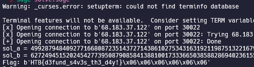

# Cyber Apocalypse 2023

## Elliptic Labrynth

> As you navigate through the labyrinth inside the tomb, you encounter GPS inaccuracies that make it difficult to determine the correct path to the exit. Can you overcome the technical issues and use your instincts to find your way out of the maze?
>
>  README Author: [ch0vid99](chovid99.github.io)
>
> [`crypto_elliptic_labrynth.zip`](crypto_elliptic_labrynth.zip)

## Initial Analysis
For this challenge, we were given a file called server.py. Below is the given code.
```
import os, json
from hashlib import sha256
from random import randint
from Crypto.Util.number import getPrime, long_to_bytes
from Crypto.Cipher import AES
from Crypto.Util.Padding import pad
from sage.all_cmdline import *
# from secret import FLAG
FLAG = b'flag{fake_flag}'


class ECC:

    def __init__(self, bits):
        self.p = getPrime(bits)
        self.a = randint(1, self.p)
        self.b = randint(1, self.p)

    def gen_random_point(self):
        return EllipticCurve(GF(self.p), [self.a, self.b]).random_point()


def menu():
    print("1. Get parameters of path")
    print("2. Get point in path")
    print("3. Try to exit the labyrinth")
    option = input("> ")
    return option


def main():
    ec = ECC(512)
    print(f'{ec.p = }')
    print(f'{ec.a = }')
    print(f'{ec.b = }')

    while True:
        choice = menu()
        if choice == '1':
            r = randint(ec.p.bit_length() // 3, 2 * ec.p.bit_length() // 3)
            print(
                json.dumps({
                    'p': hex(ec.p),
                    'a': hex(ec.a >> r),
                    'b': hex(ec.b >> r)
                }))
        elif choice == '2':
            A = ec.gen_random_point()
            print(json.dumps({'x': hex(A[0]), 'y': hex(A[1])}))
        elif choice == '3':
            iv = os.urandom(16)
            key = sha256(long_to_bytes(pow(ec.a, ec.b, ec.p))).digest()[:16]
            cipher = AES.new(key, AES.MODE_CBC, iv)
            flag = pad(FLAG, 16)
            print(
                json.dumps({
                    'iv': iv.hex(),
                    'enc': cipher.encrypt(flag).hex()
                }))
        else:
            print('Bye.')
            exit()


if __name__ == '__main__':
    main()
```
Reading through the code, we can see that this is an ECC (Elliptic Curve) challenge. If we connect to the server, there will be three menu that we can use:

The first one is used to dump some informations related to the parameter of the ECC, which is:

$p$
$a_{msb}$ (a >> r) where r is random with range from p.bit_length()/3 until 2\*p.bit_length()/3
$b_{msb}$ (b >> r)
The second menu can be used to generate a random point in the curve
The third menu is used to dump the encrypted flag (with AES), where the AES key is encrypted with key sha256(long_to_bytes(pow(ec.a, ec.b, ec.p))).digest()[:16]

So, based on that initial analysis, the target for this chall is to recover the ECC parameter (a, b, p).

## Solution

Well, we can recover p from the first menu (They provide the p value). So now, we need to recover a and b. Remember that the ECC curve equation is like below:
$$
y^2 = x^3 + ax + b \mod p
$$
Now, remember that from the second menu, we can generate many points that reside in the curve. As you can see, if we have two points, it become two equations with two unknown variable, which is solvable (and for this challenge, we actually don’t need the leak of a and b at all!).
So, to recover the a and b, we just need to recover two points, and then subtract it to remove a. See below equations:
$$
\begin{align}
y_1^2 = x_1^3 + ax_1 + b \mod p \\
y_2^2 = x_2^3 + ax_2 + b \mod p \\
\end{align}
$$
If we subtract the above equations, we will get a new equation like below
$$
\begin{align}
(y_1^2 - y_2^2) = (x_1^3 -x_2^3) + a(x_1-x_2) \mod p \\
((y_1^2 - y_2^2) - (x_1^3 -x_2^3))(x_1-x_2)^{-1} = a \mod p \\
\end{align}
$$
Now that we can recover a from the above equation, recovering b is trivial.
$$
b = y^2 - x^3 - a\*x
$$
After recovering a and b, we can retrieve the AES key, and use it to decrypt.
Below is the solver that I use (sage script):
```
from pwn import *  
import os, json
from hashlib import sha256
from random import randint
from Crypto.Util.number import getPrime, long_to_bytes
from Crypto.Cipher import AES
from Crypto.Util.Padding import pad

r = remote(b'167.71.143.44', int(31762))
r.sendlineafter(b'> ', b'1') 
out = json.loads(r.recvline().strip()) 
p = int(out['p'], 16) 
partial_a = int(out['a'], 16) 
partial_b = int(out['b'], 16) 
xy_data = [] 
for i in range(2):
    r.sendlineafter(b'> ', b'2') 
    xy_out = json.loads(r.recvline().strip()) 
    xy_data.append([int(xy_out['x'], 16), int(xy_out['y'], 16)])
r.sendlineafter(b'> ', b'3')
enc_out = json.loads(r.recvline().strip())
iv = bytes.fromhex(enc_out['iv'])
enc = bytes.fromhex(enc_out['enc'])

'''
y1^2 = x1^3 + a*x1 + b mod p
y2^2 = x2^3 + a*x2 + b mod p
----------------------------- subtract
(y1^2 - y2^2) = (x1^3 -x2^3) + a*(x1-x2) mod p
((y1^2 - y2^2) - (x1^3 -x2^3))*(x1-x2)^-1 = a mod p
'''
x1, y1 = xy_data[0]
x2, y2 = xy_data[1]
sol_a = (((y1^2 - y2^2) - (x1^3 -x2^3))*inverse_mod(x1-x2, p)) % p
sol_b = (y1^2 - x1^3 - sol_a*x1) % p
print(f'{sol_a = }')
print(f'{sol_b = }')

key = sha256(long_to_bytes(pow(int(sol_a), int(sol_b), p))).digest()[:16]
cipher = AES.new(key, AES.MODE_CBC, iv)
print(f'Flag: {cipher.decrypt(enc)}')
```


## Flag
HTB{d3fund_s4v3s_th3_d4y!}