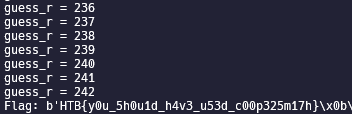

# Cyber Apocalypse 2023

## Elliptic Labrynth Revenge

> As you navigate through the labyrinth inside the tomb, you encounter GPS inaccuracies that make it difficult to determine the correct path to the exit. Can you overcome the technical issues and use your instincts to find your way out of the maze?
>
>  README Author: [ch0vid99](chovid99.github.io)
>
> [`crypto_elliptic_labrynth_revenge.zip`](crypto_elliptic_labrynth_revenge.zip)

## Initial Analysis
This is the revenge of the previous challenge. The only different is that in the previous challenge we can retrieve multiple points, but for this challenge, we can only retrieve one point.

```
import os, json
from hashlib import sha256
from random import randint
from Crypto.Util.number import getPrime, long_to_bytes
from Crypto.Cipher import AES
from Crypto.Util.Padding import pad
from sage.all_cmdline import *
FLAG = b'flag{fake_flag}'


class ECC:

    def __init__(self, bits):
        self.p = getPrime(bits)
        self.a = randint(1, self.p)
        self.b = randint(1, self.p)

    def gen_random_point(self):
        return EllipticCurve(GF(self.p), [self.a, self.b]).random_point()


def menu():
    print("1. Get parameters of path")
    print("2. Try to exit the labyrinth")
    option = input("> ")
    return option


def main():
    ec = ECC(512)
    print(f'{ec.p = }')
    print(f'{ec.a = }')
    print(f'{ec.b = }')

    A = ec.gen_random_point()
    print("This is the point you calculated before:")
    print(json.dumps({'x': hex(A[0]), 'y': hex(A[1])}))

    while True:
        choice = menu()
        if choice == '1':
            r = randint(ec.p.bit_length() // 3, 2 * ec.p.bit_length() // 3)
            print(
                json.dumps({
                    'r': r,
                    'p': hex(ec.p),
                    'a': hex(ec.a >> r),
                    'b': hex(ec.b >> r)
                }))
        elif choice == '2':
            iv = os.urandom(16)
            key = sha256(long_to_bytes(pow(ec.a, ec.b, ec.p))).digest()[:16]
            cipher = AES.new(key, AES.MODE_CBC, iv)
            flag = pad(FLAG, 16)
            print(
                json.dumps({
                    'iv': iv.hex(),
                    'enc': cipher.encrypt(flag).hex()
                }))
        else:
            print('Bye.')
            exit()


if __name__ == '__main__':
    main()

```
However, remember that we actually have a leak for the a and b param, which is the MSBs of them. So, we need to use that leak to retrieve it.

## Solution
Let’s take a look on the how the leak generated.
```
r = randint(ec.p.bit_length() // 3, 2 * ec.p.bit_length() // 3)
print(
    json.dumps({
        'r': r,
        'p': hex(ec.p),
        'a': hex(ec.a >> r),
        'b': hex(ec.b >> r)
    })
)
```
Notice that the p.bit_length() is 512. So, the range of r is from 170 - 340. So, it can be bruteforced. Remember that the ECC equation is like below:
$$
y^2 = x^3 + ax + b \mod p
$$
And with our leak, the equation can be rearranged like below:
$$
y^2 = x^3 + (2^ra_{leaked} + c) + {2^rb_{leaked} + d} \mod p
$$
Notice that the r is bruteforce-able, and the value of $c$ and $d$ is small compared to the other value ($y^2$, $x^3$, and $2^r$). On this kind of challenge, we actually can try to retrieve the $c$ and $d$ value with Coppersmith.
We can reuse the defund implementation of coppersmith in here to do the coppersmith in the equation.
After retrieving the value $c$ and $d$, we will be able to get the value $a$ and $b$.
Below is my script (sage script)
```
from pwn import *  
import os, json
from hashlib import sha256
from random import randint
from Crypto.Util.number import getPrime, long_to_bytes
from Crypto.Cipher import AES
from Crypto.Util.Padding import pad

import itertools

def small_roots(f, bounds, m=1, d=None):
	if not d:
		d = f.degree()

	R = f.base_ring()
	N = R.cardinality()
	
	f /= f.coefficients().pop(0)
	f = f.change_ring(ZZ)

	G = Sequence([], f.parent())
	for i in range(m+1):
		base = N^(m-i) * f^i
		for shifts in itertools.product(range(d), repeat=f.nvariables()):
			g = base * prod(map(power, f.variables(), shifts))
			G.append(g)

	B, monomials = G.coefficient_matrix()
	monomials = vector(monomials)

	factors = [monomial(*bounds) for monomial in monomials]
	for i, factor in enumerate(factors):
		B.rescale_col(i, factor)

	B = B.dense_matrix().LLL()

	B = B.change_ring(QQ)
	for i, factor in enumerate(factors):
		B.rescale_col(i, 1/factor)

	H = Sequence([], f.parent().change_ring(QQ))
	for h in filter(None, B*monomials):
		H.append(h)
		I = H.ideal()
		if I.dimension() == -1:
			H.pop()
		elif I.dimension() == 0:
			roots = []
			for root in I.variety(ring=ZZ):
				root = tuple(R(root[var]) for var in f.variables())
				roots.append(root)
			return roots

	return []

r = remote(b'165.232.100.46', int(31844))

# Retrieve x y
r.recvuntil(b':\n')
xy_out = json.loads(r.recvline().strip())
x, y = int(xy_out['x'], 16), int(xy_out['y'], 16)

# Retrieve partial_a and partial_b
r.sendlineafter(b'> ', b'1') 
out = json.loads(r.recvline().strip()) 
p = int(out['p'], 16) 
partial_a = int(out['a'], 16) 
partial_b = int(out['b'], 16)
r.sendlineafter(b'> ', b'2')
enc_out = json.loads(r.recvline().strip())
iv = bytes.fromhex(enc_out['iv'])
enc = bytes.fromhex(enc_out['enc'])

'''
f(x) = x^3 - y^2 + (partial_a*2^r + c)*x + (partial_b*2^r + d) mod p
c and d is small, r is bruteforceable
bounds = [2^r, 2^r]
'''
print(f'{p = }')
for guess_r in range(p.bit_length() // 3, 2*p.bit_length() // 3):
	P.<c, d> = PolynomialRing(Zmod(p))
	bound = 2^(guess_r)
	print(f'{guess_r = }')
	f = x^3 - y^2 + x*(partial_a*2^guess_r + c) + (partial_b*2^guess_r +d)
	bounds = (bound, bound)
	sols = small_roots(f, bounds, m = 7, d=3)
	if len(sols) > 0:
		for sol in sols:
			sol_a = int(sol[0]) + partial_a*2^guess_r
			sol_b = int(sol[1]) + partial_b*2^guess_r
			key = sha256(long_to_bytes(pow(int(sol_a), int(sol_b), p))).digest()[:16]
			cipher = AES.new(key, AES.MODE_CBC, iv)
			print(f'Flag: {cipher.decrypt(enc)}')
		exit()

```



## Flag
HTB{y0u_5h0u1d_h4v3_u53d_c00p325m17h}