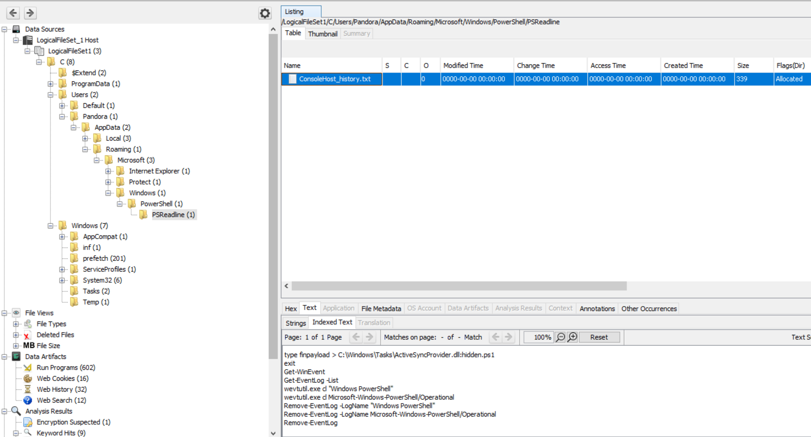
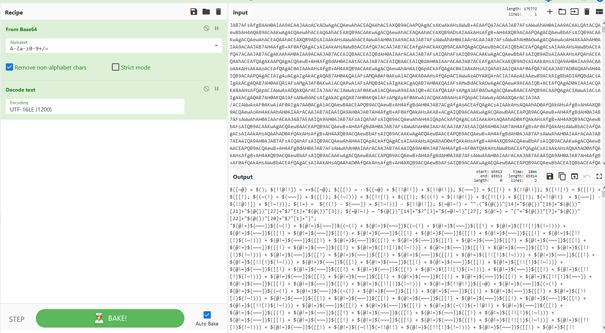
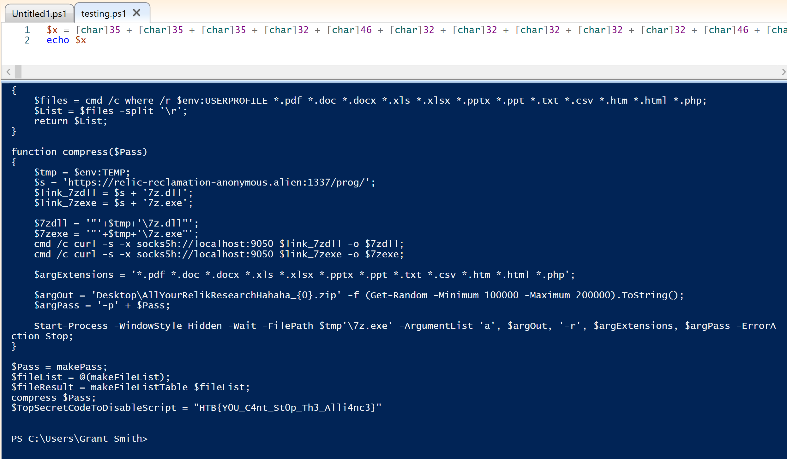

# Cyber Apocalypse 2023

## Artifacts of Dangerous Sightings

> Pandora has been using her computer to uncover the secrets of the elusive relic. She has been relentlessly scouring through all the reports of its sightings. However, upon returning from a quick coffee break, her heart races as she notices the Windows Event Viewer tab open on the Security log. This is so strange! Immediately taking control of the situation she pulls out the network cable, takes a snapshot of her machine and shuts it down. She is determined to uncover who could be trying to sabotage her research, and the only way to do that is by diving deep down and following all traces ...
>
>  README Author: [S1n1st3r](https://s1n1st3r.gitbook.io/)
>

With this challenge we started with a disk image. Now, this image was a VHDX file. This just happens to be pretty much unsupported by Autopsy, the tool I really wanted to use for this. Now this caused me a quick headache but I got it working by using FTK Imager to mount the image on my machine and then open the mounted disk as a data source with Autopsy.
Now with it mounted I could let Autospy analyze the disk and I could poke around easier. After poking around for about 10 minutes I came across the ConsoleHost_history.txt file. In here was the powershell command history... Very spicy.
It was indeed very spicy and had something called "finpayload" being hidden inside ActiveSyncProvider.dll.


Now, because we had the whole disk, we can go grab that ActiveSyncProvider.dll file and extract whats in there. Easy Peasy.


After extracting it we are left with so much encoded powershell. Yuck. Lets get it back into plaintext...



Ew. This is even grosser than the encoded powershell.
Where do I even start?
I didn't know, but after some googling I figured out what it was doing. It was starting by creating variables with values of 0, 1, 2, 3, etc. This was done with this section:
```
${[~@} = $(); ${!!@!!]} = ++${[~@}; ${[[!} = --${[~@} + ${!!@!!]} + ${!!@!!]}; ${~~~]} = ${[[!} + ${!!@!!]}; ${[!![!} = ${[[!} + ${[[!}; ${(~(!} = ${~~~]} + ${[[!}; ${!~!))} = ${[!![!} + ${[[!}; ${((!} = ${!!@!!]} + ${[!![!} + ${[[!}; ${=!!@!!}  = ${~~~]} - ${!!@!!]} + ${!~!))}; ${!=} =  ${((!} - ${~~~]} + ${!~!))} - ${!!@!!]}; ${=@!~!} = "".("$(@{})"[14]+"$(@{})"[16]+"$(@{})"[21]+"$(@{})"[27]+"$?"[1]+"$(@{})"[3]); ${=@!~!} = "$(@{})"[14]+"$?"[3]+"${=@!~!}"[27]; ${@!=} = "["+"$(@{})"[7]+"$(@{})"[22]+"$(@{})"[20]+"$?"[1]+"]";
```
I didn't know it but apparently "++${[~@}" is equal to 1 in powershell. And each integer can be encoded in a similar, weird, way.
I got to this by using powershell ISE and putting a breakpoint at the end and then hovering over each variable to get their value. I would then go back to the saved text I had and find and replace all with the appropriate character/integer.
At the end of that I had this file: {Authors note: I'm not including the file, it looks icky}


With this I could just change the iex at the end of the file to an echo and get the contents by running it. And thats what I did.
