# Cyber Apocalypse 2023

## Artifacts of Dangerous Sightings

> We noticed some interesting traffic coming from outer space. An unknown group is using a Command and Control server. After an exhaustive investigation, we discovered they had infected multiple scientists from Pandora’s private research lab. Valuable research is at risk. Can you find out how the server works and retrieve what was stolen?
>
>  README Author: [nitrolabs](https://nitrolabs.xyz/)
>

This challenge gives us another packet capture with TCP and HTTP traffic. Following the TCP streams, the very first stream is a GET request for a powershell script.
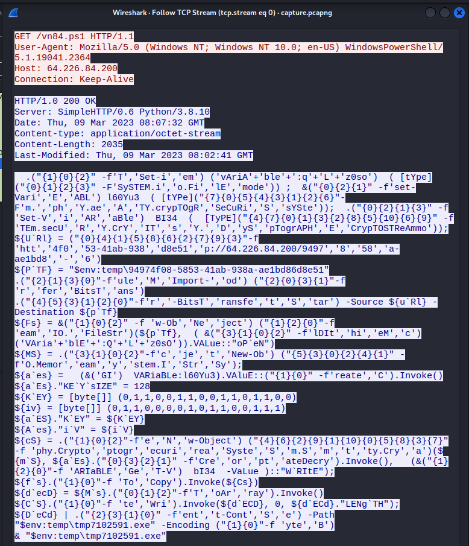

Similar to the batch script in the previous challenge (Relic maps), this script is obfuscated and utilizes AES encryption. I attempted to use PowerDecode, which failed, but PSDecode was successful.
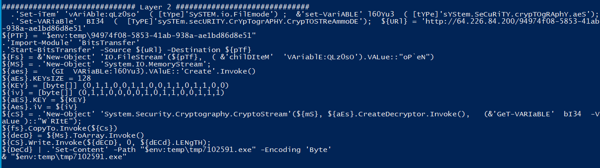

This script downloads an external payload and moves it to the temporary directory, decrypts the payload, and runs the resultant executable.

The third TCP stream shows the capture of the payload being downloaded.
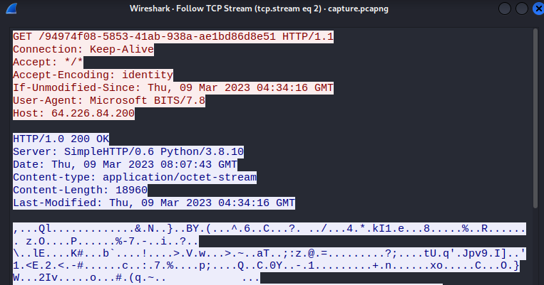


I recovered this payload from the packet capture and decrypted it using CyberChef.
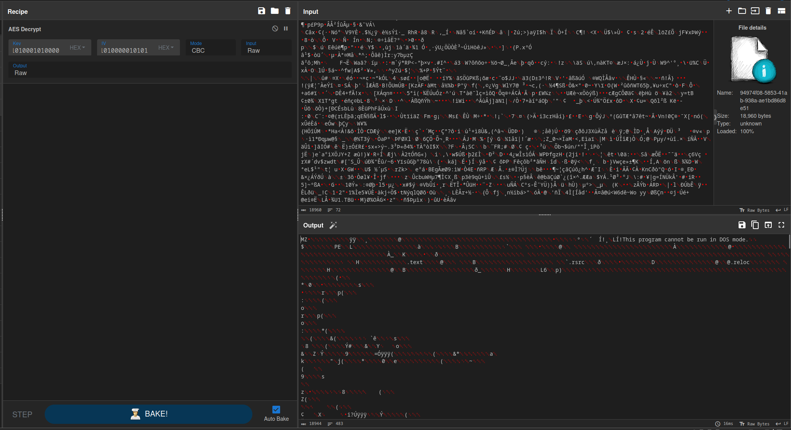

I then downloaded the binary and loaded into Ghidra for analysis. There were a few different functions, including Encryption, Decryption, and ImplantCore. I also ran a search for strings, which returned a few interesting results. The most interesting was a file name, dropper_cs.exe.
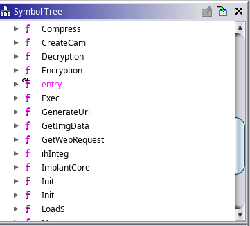
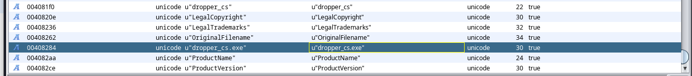

A quick online search revealed that this was most likely a dropper for PoshC2, a popular open-source command and control framework.
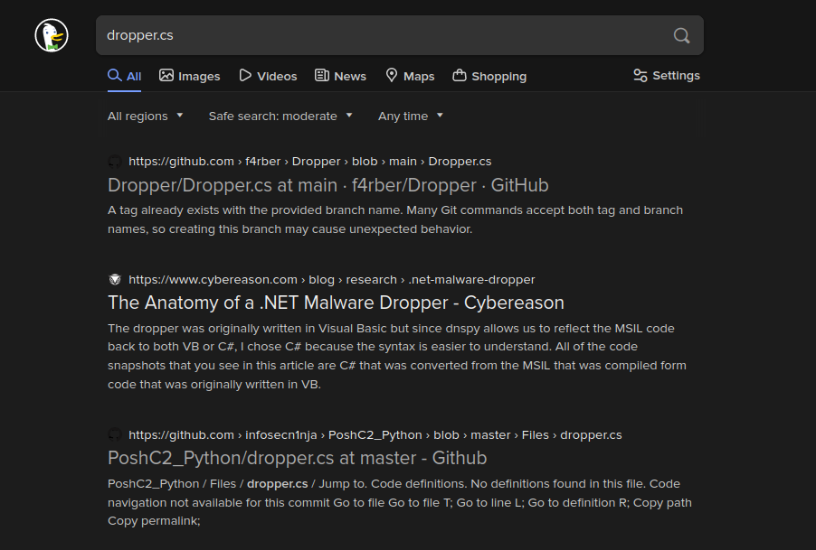

I verified this by comparing the strings that Ghidra located to the source code for this dropper.
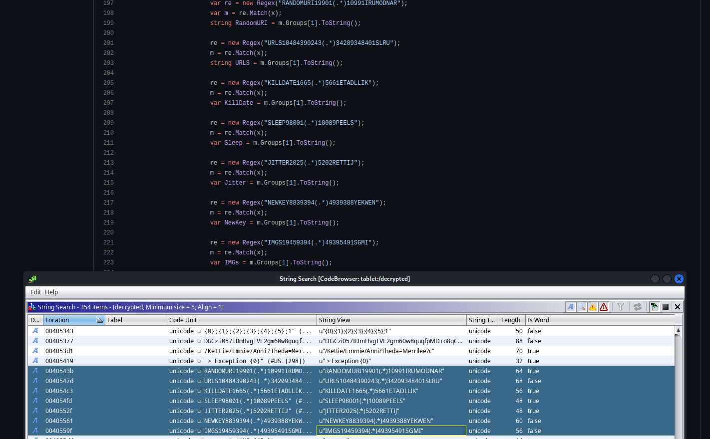

This [blog post](https://blogs.keysight.com/blogs/tech/nwvs.entry.html/2021/08/28/posh_c2_-_commandandcontrol-xVbY.html) from Keysight goes into detail about how PoshC2 works, and this was the basis for me solving this challenge.

For the next stage (stage 1 in the blog post), there is a request with a session ID that is both Base64 encoded and AES encrypted.
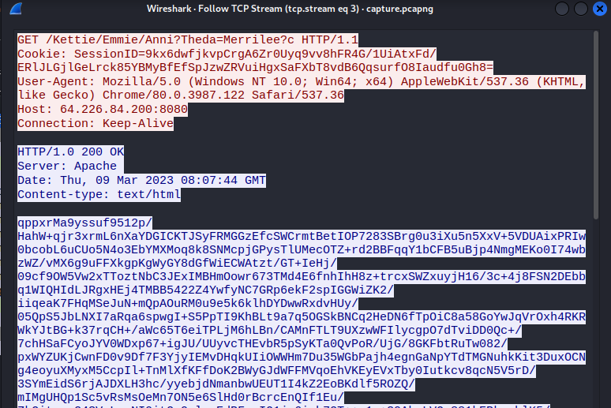

Fortunately for us, the binary contains the Base64 encoded AES private key.
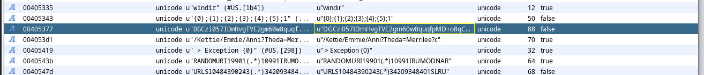

I wrote a Python script based off the ruby script that the author of the blog post used to decrypt the payload.
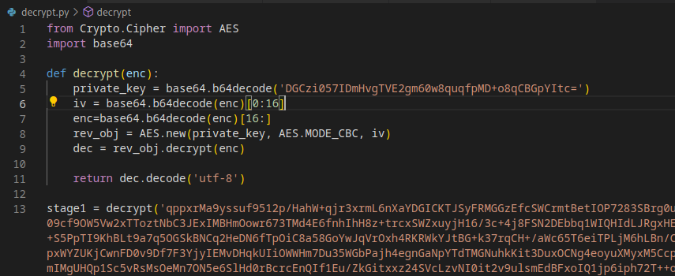

In this decrypted payload, I can barely makeout the new AES key that is used to encrypt the future communications, as well as random URIs that are used for beaconing and task execution.
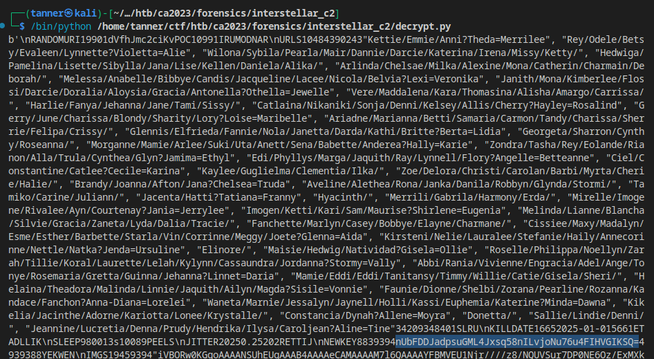

For task execution, the contents of the GET request are encoded and encrypted as well. The task responses are POST requests that are back to the C2 server in a complex form. The output is first compressed using Gzip, then encrypted with AES, and then is appended to a 1500 byte PNG image before being sent back to the C2 server. So I started looking for POST requests.

When I looked at the HTTP objects, I noticed one that was much larger than the others. This object corresponded to a request that began at packet 7242. Given its large size, I decided to investigate it first.
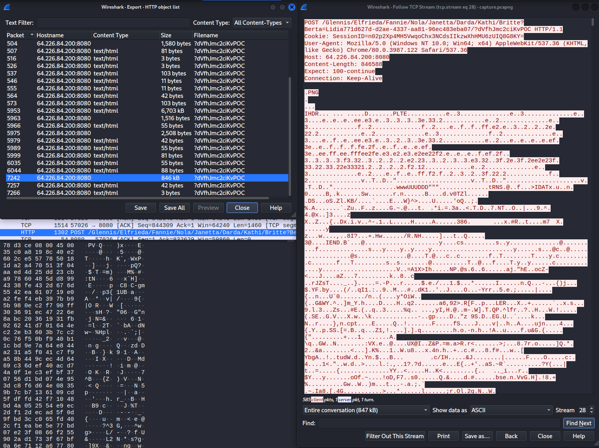

I wrote a script to decrypt and decode the data from the task’s output.
```
from Crypto.Cipher import AES
from Crypto.Util.Padding import pad
import base64
import gzip

def get_file():
    private_key = base64.b64decode('nUbFDDJadpsuGML4Jxsq58nILvjoNu76u4FIHVGIKSQ=')
    enc=bytes.fromhex(data)[1500:]
    iv = enc[0:16]
    enc=enc[16:]
    obj = AES.new(private_key, AES.MODE_CBC, iv)
    dec = obj.decrypt(enc)
    return gzip.decompress(dec).decode()

f = open("pkt7242-hex", "r")
data = f.read()

g = open("test","wb")
out_file = get_file()
g.write(base64.b64decode(out_file))
```
I took the input from that large post request, converted it to hex, and fed it into the script. I added the second base64 decode statement after I discovered that the output was also base64 encoded.

The output of the file turned out to be a PNG image file!
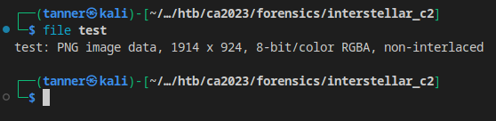

Opening the image in ristretto, I see the flag in a sticky note in the top right corner of the screen.
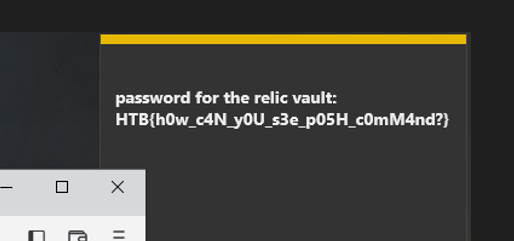

## Flag
HTB{h0w_c4N_y0U_s3e_p05H_c0mM4nd?}