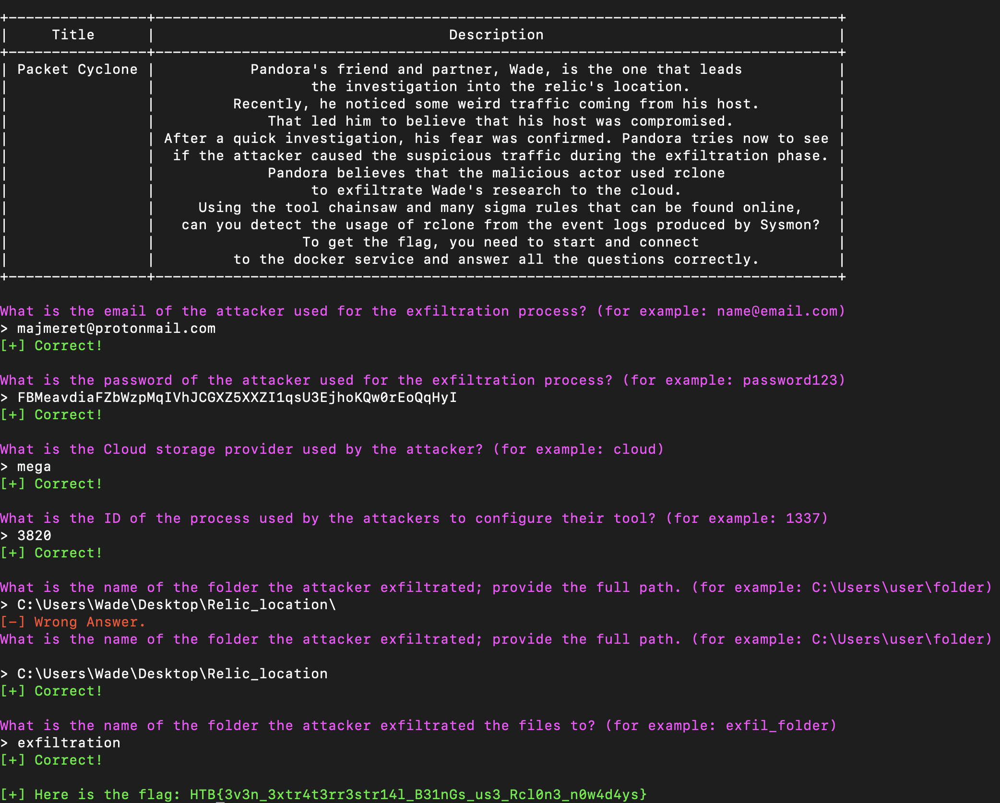

# Cyber Apocalypse 2023

## Packet Cyclone

> Pandora's friend and partner, Wade, is the one that leads the investigation into the relic's location. Recently, he noticed some weird traffic coming from his host. That led him to believe that his host was compromised. After a quick investigation, his fear was confirmed. Pandora tries now to see if the attacker caused the suspicious traffic during the exfiltration phase. Pandora believes that the malicious actor used rclone to exfiltrate Wade's research to the cloud. Using the tool called "chainsaw" and the sigma rules provided, can you detect the usage of rclone from the event logs produced by Sysmon? To get the flag, you need to start and connect to the docker service and answer all the questions correctly.
>
>  README Author: [Fra-SM](https://github.com/Fra-SM)
>

The goal of this challenge was to analyze a set of Windows EVTX logs using [chainsaw](https://github.com/WithSecureLabs/chainsaw) in combination with the provided Sigma rules, in order to uncover the malicious usage of a tool called rclone. After downloading the tool and running the following command:

`./chainsaw hunt EVTX-ATTACK-SAMPLES/ -s SIGMA-RULES/ --mapping mappings/sigma-event-logs-all.yml`

we get a few detections of suspicious events. Connecting to the docker instance of HTB, we have to answer some questions about our collected findings before we can have our flag. Below is a screenshot of all the correct answers:

## Flag
HTB{3v3n_3xtr4t3rr3str14l_B31nGs_us3_Rcl0n3_n0w4d4ys}