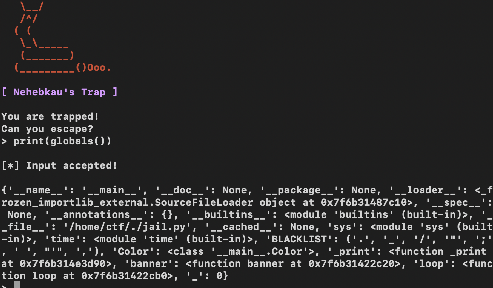

# Cyber Apocalypse 2023

## Neheb

> In search of the ancient relic, you go looking for the Pharaoh's tomb inside the pyramids. A giant granite block falls and blocks your exit, and the walls start closing in! You are trapped. Can you make it out alive and continue your quest?
>
>  README Author: [Fra-SM](https://github.com/Fra-SM)
>

Tags: _misc__

## Nehebkaus trap

This challenge involved breaking out of a restricted Python shell interpreter. Basically we can only input commands that don't contain certain special characters. The list (actually a Python tuple) containing these characters is contained in a global variable that we can view using `print(globals())`:

After a lot of failed attempts at it, I came up with a solution consisting of the following sequence of commands:

- `exec(input())`
- `globals()['BLACKLIST']=list(globals()['BLACKLIST'])`
- `exec(input())`
- `globals()['BLACKLIST’]=[]`
- `print(open(“flag.txt”,”r”).read())`

What this does is:

- converts the tuple into a list so we can change it later (we can't actually delete it right away since the program will crash);
- empties the list;
- outputs the flag file content.

## HTB{y0u_d3f34t3d_th3_sn4k3_g0d!}