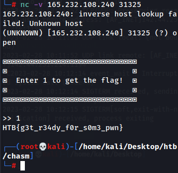

# Initialize Connection - HTB Cyber Apocalypse 2023
> Writeup Author: [bobAKAbill](https://github.com/bobAKAbill)
>

##Description
In order to proceed, we need to start with the basics. Start an instance, connect to it via $ nc e.g. nc 127.0.0.1 1337 and send "1" to get the flag.

##Solution
All that needs done for this challenge is to spawn the docker and connect to it, then follow the instructions.
