# Cyber Apocalypse 2023

## Analogue Signal Processing

> You finally manage to remotely connect to a computer onboard the alien vessel to shutdown the defense mechanisms. However, it instantly starts acting up and ends up deploying malware as a defense mechanism. All your documents including your hard earned map of the vessel topology is now encrypted.
>
>  Readme Author: [bi0s](https://blog.bi0s.in/)
> 
> [`rev_vessel_cartographer.zip`](rev_vessel_cartographer.zip)

And we are given two files

1. Challenge.exe
2. vessel_map.jpeg.owo
So, on the base level, it ought to be malware that encrypts files
Now we move on to figuring out how.

## Triaging:
Just running the binary inside a VM doesn’t seem to affect much inside the binary, nor is trying to pass it as an argument seem to make a difference.

And trying pintools on the binary also seems to result in an error. Hmm, that’s odd, seems to have implemented an anti-debug check

Static Analysis:
It is UPX packed, so we go ahead and unpack it and load it back again in IDA.

Functions:
main

We find main() fairly easily, given it’s not stripped

sub_140001080 (AKA) GetFuncByHash
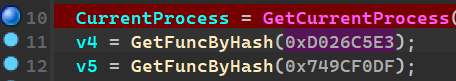

Main first calls these functions with an integer value return values are in v4 and v5.
And later v4 and v5 are called dynamically as functions. So it is safe for us to assume that this would be a GetFunctionByHash

sub_1590


Unsure of what it does, we’ll keep it aside for now

v4 and v5 functions
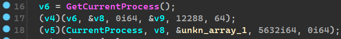

The dynamically resolved functions are now called where unkn_array_1 is a byte_array of length 16.
We hope to find this out later during the process of debugging to see what are the APIs being called

sub_140001210 (AKA) Unkn_func_3
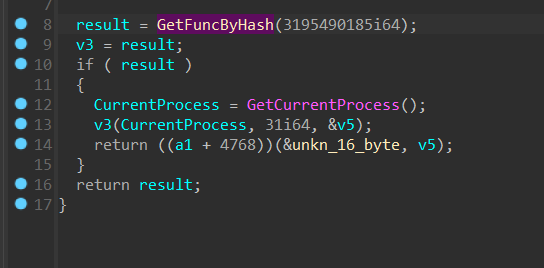

This function also employs GetFuncByHash() and calls another API, it is safe to assume v5 might be the return value. This in turn is being used as an argument in the next function call based on the function parameter a1 (a1 passed as v8 in main, is the variable used inside the API called by v5 and v4)

We’ll get to how and why I named the byte array `unkn_16_byte` in the next sub_function

sub_140001290 (AKA) Encrypt_Func

Now we get to the Function which seems to give us a basic idea of what exactly is being carried out in terms of encryption inside the binary.

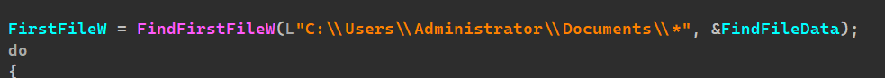

We seem to check for this directory,

and a bunch of operations(analyzed below) later we see below a set routine of syscalls
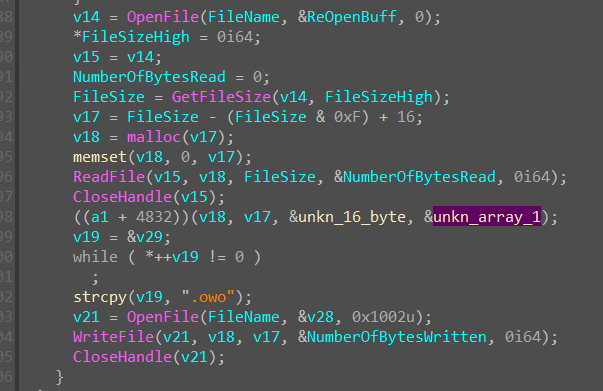

OpenFile
ReadFile
CloseFileHandle

Some function with two bytearray’s as args and v17, v18(the buffers from readfile)

Then Writefile with v18,v17 as args
CloseFileHandle

So it is safe to assume as from a HUNCH that,

1. It takes in Two buffers B1 (unkn_16_byte) and B2 (unkn_array_1) each 16 bytes in length
2. Reads from File A
3. Encrypts file_bytes using B1, and B2 under some Encryption Algorithm and stores it into a new file.
4. Both of these B1 and B2 are 16 bytes long and they
5. Also going by the strcpy(), a hunch can be that it stores the filename and is appended the “.owo” before writing to it.

The current hunch is going to be that the encryption algorithm used is AES under CBC mode given it has a key as well as a {authors note: the readme cuts off here \>\_\<}

## Dynamic Analysis
Current Objective:
 Get the debugging process up and running
Attaching a debugger and stepping through results in an exception being thrown with error code 0x5 for MEMORY_ACCESS_VIOLATION inside ntdll.

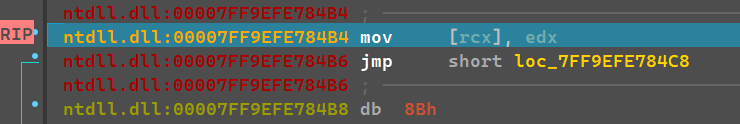
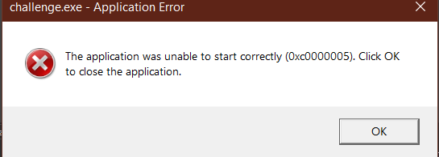


Now, that’s interesting!! So, the malware author implemented either an existing or a custom anti-debug check method/routine wherein the process can identify if it is being debugged before even it gets to the challenge file’s code/the start()

So, the program is started by the OS, and during the RT setup, some function checks if there is a presence of a debugger or not.

Now we go back into the binary and search for “Debugger” inside functions we get nothing, next thought is to check for it in strings, and Lo and Behold! we are led to
Tls_Callback_0
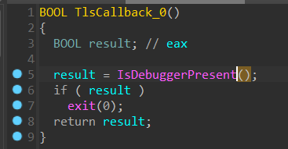


So googling about this we get to :
Tls_Callback_0_Anti-Debug
```
TLS callback is a function that is called before the process entry point executes.
If you run the executable with a debugger, the TLS callback will be executed before the debugger breaks. You can see the TLS callback is called by the loader during process startup.
```
So right now we just patch the assembly from a jz to jnz to let debuggers work through this
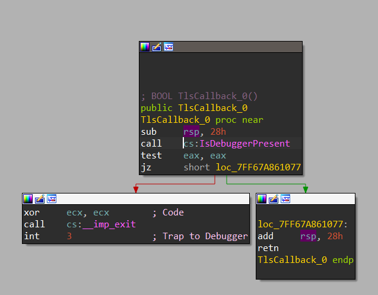


And BOOM! now we can enter the user code of the binary.

Objective : Get the debugging process up and running :heavy_check_mark:

## Current Objective:
Figure out what APIs are being resolved by hashing

In main :

v4() <—–> NtAllocateVirtualMemory
v5() <—–> NtWriteVirtualMemory

So it creates a virtual memory space and writes the contents in unkn_array_1 into that memory space

We set a `Hardware Breakpoint` at this place just in case
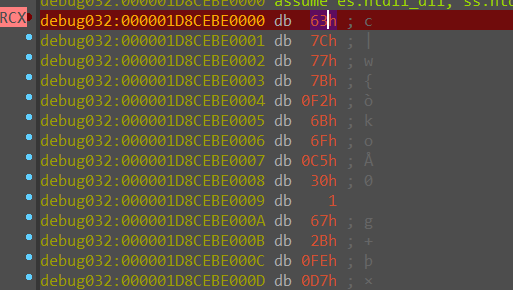

In sub_1210 (AKA) Unkn_func_3 :

v3() <—-> NtQueryInformationProcess

Objective down: Figure out what APIs are being resolved by hashing

## Function specific reversing:
sub_1590
Upon debugging we see this function achieves nothing nor does return anything useful under any register, it copies the buffer, runs a while loop for 0x1600 times, set the variable result to that value and returns result :face_palm:

sub_140001210 (AKA) Unkn_func_3


Stepping into this, we found out the API being called is NTQueryInformationProcess, and it returns v5.

So we pull up NtQueryInformationProcess’s MSDN
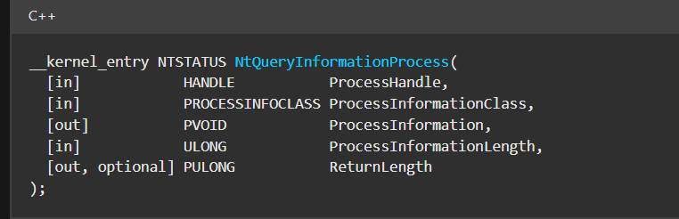


I have a suspicion that this might involve some form of tomfoolery with the PEB structure or ProcessInformationClass given a constant value has been passed on as the second argument
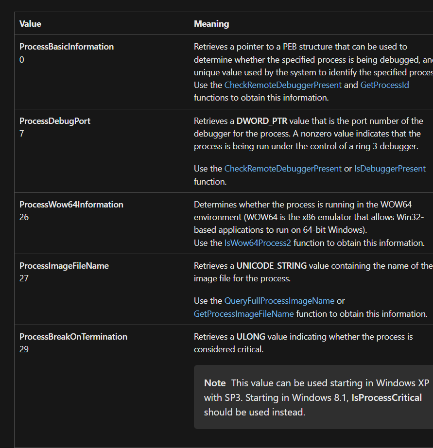

The next step was to google and confirm our hunch,
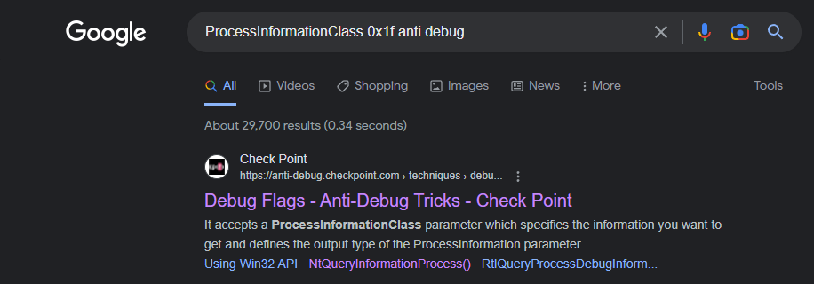


Search as such, gives us what we need right in the first link Anti-Debug-Checks

So the third argument (ie) v5 is dwProcessDebugFlags, and, if the process is being debugged it would be set to 0, and if not 1

With that in mind, we now move on to the next function call inside the binary,
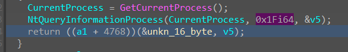


Now this function is being called by using the first argument as the function pointer, and a1 happens to be the unkn_16_byte (which I assume is either the key or IV), and the second argument is the dwProcessDebugFlag
```
dwProcessDebugFlag is 0 if being debugged
                   is 1 if not being debugged
```
Now, we know the calling convention of windows functions


So we manually change the EDX register value to 1 and continue execution by hitting f7

now converting it all to code,
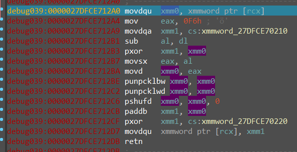


we see it makes use of xmmwords (128-bit registers) to do some operations

We are unsure of such opcodes, but our goal rn is to retrieve the unkn_16_byte array as if the program was never debugged.

And we seem to easily accomplish that by just passing through the instructions and finally examining the RCX value before the return.

We get the unkn_16_byte array to be
`6D597133733676397924422645294840`

sub_1290 (AkA) EncryptFunc
This function seems to get the HANDLE to the first file under “C:\Users\Administrator\Documents\“
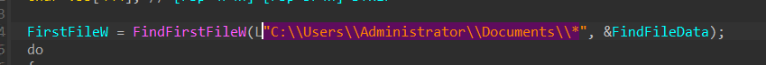


Then it goes onto this part of the code
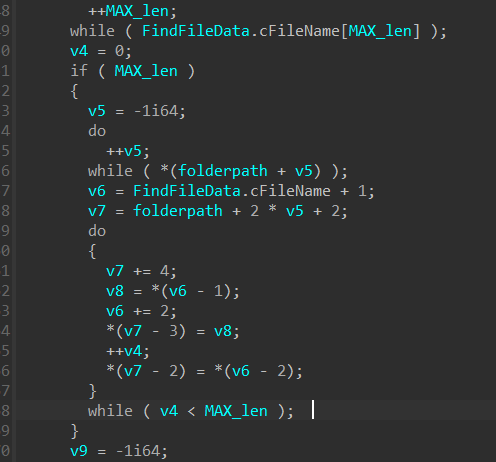
The above snippet is responsible for just copying over the file path string from the buffer to the variables. Unimportant.
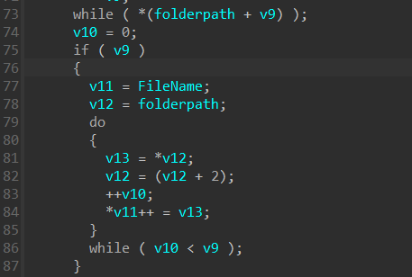

This above part of the code is responsible for converting
the filename to UTF-8 from wide char(Microsoft/Windows stores text in the form of UTF-16 to ensure broader encompassing of symbols/characters, this is AKA wide char where each character is given space of 2 bytes, the unused byte is nulled out)

Then the UTF-8 converted text is put in the routine of
```
OPEN
READ
CLOSE
<ENCRYPT>
OPEN
WRITE
CLOSE
```
## The Core
And now we get to the core of the binary
This encrypt function determines the entire functionality purpose of the binary
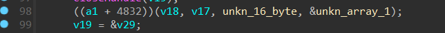


Before going into the function, we see it takes in the unkn_16_byte we retrieved and another array with just the null bytes(chances for it being the IV incase this is AES)

Now we step into the function, by hitting f7
we get bytes, we continue hitting c to convert it to code and p to define it as a function in IDA
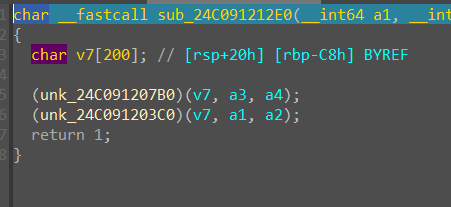
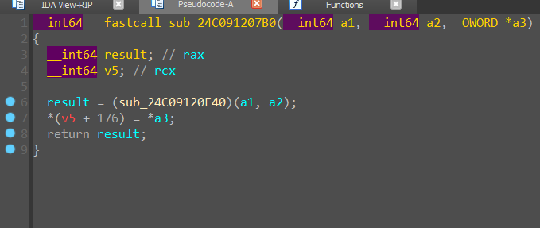

Once we are a couple of functions in, we notice
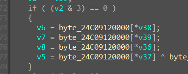


Checking out the byte array,
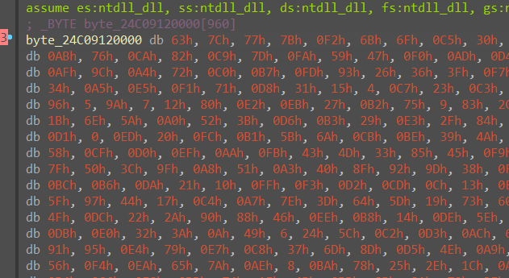


We see it is exactly the S-box used in AES.

Now we have confirmed the encryption algorithm being used as well by taking a step-by-step approach.

All we have left is to decrypt the given .owo file and that should give us the FLAG

# The Script
```
from Crypto.Cipher import AES
f1 = open("flag.png","wb")
x = AES.new((key=b'mYq3s6v9y$B&E)H@', mode=AES.MODE_CBC, iv=b'\x00'*16)
f2 = open("vessel_map.jpeg.owo", "rb")
bytes = f2.read()
f1.write(x.decrypt(bytes))
```
key = b’mYq3s6v9y$B&E)H@’ is our unkn_16_byte in bytes format
iv = 16 null bytes (ie) ‘\x00’ * 16

OR

We can use CyberChef
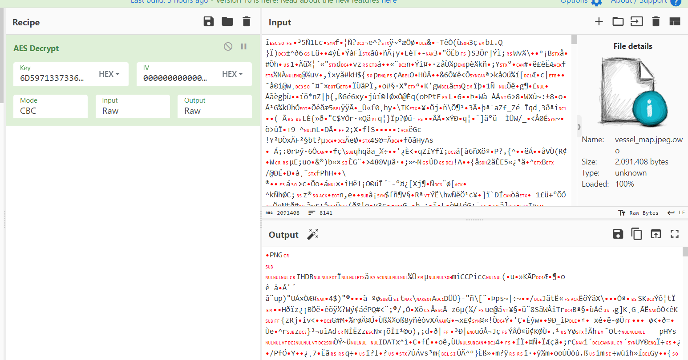

To retrieve the flag file

## The Flag
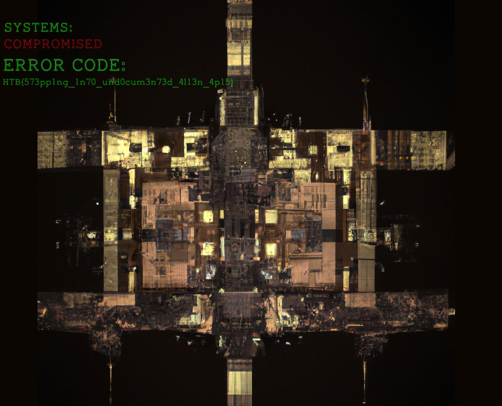

HTB{573pp1ng_1n70_und0cum3n73d_4113n_4p15}