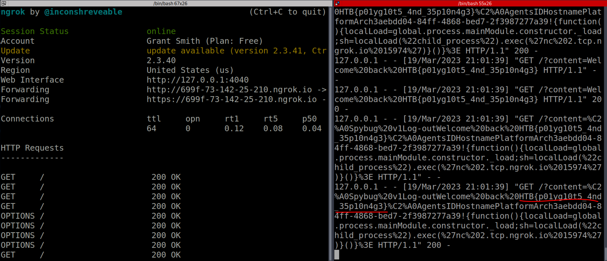

# Hack the Box Cyber Apocalypse CTF 2023, SpyBug Web Challenge Writeup

> As Pandora made her way through the ancient tombs, she received a message from her contact in the Intergalactic Ministry of Spies. They had intercepted a communication from a rival treasure hunter who was working for the alien species. The message contained information about a digital portal that leads to a software used for intercepting audio from the Ministry's communication channels. Can you hack into the portal and take down the aliens counter-spying operation?
>
>  Readme Author: [gsmith257](https://s1n1st3r.gitbook.io/ctf-writeups/htb-cyber-apocalypse-2023/2023-htb-cyber-apocalypse-challenges/web-spybug)
>
> [`web_spybug.zip`](web_spybug.zip)

This challenge starts off like most normal Hack The Box web challenges, with a file download. The file is a zip containing the Docker image used to create the challenge.
Now, before I spin up the instance, I like to look through the back end and see what it is doing and if there's anything interesting I should start looking at when I spin up the container. In this case I saw an API that was for the "agents" to reach out to in order to register, upload audio, and edit their info.

Registering an agent
Right off the bat I had it in my mind this had to do with a unrestricted file upload type vulnerability. Boy was I wrong. I wasted a few hours trying to get something to work with that and got nowhere.
I did get one good thing out of this though... I can upload a file with whatever contents I want, as long as it meets the regex check on the back end. (We'll come back to this)
Now, after I had realized its probably not a file upload vulnerability that we have to exploit, I went and looked for other potential vulnerabilities. That is when I came upon the panel.pug file. This page was displaying the admin panel to the bot that views it every 50 seconds. This meant that if I could exploit a Cross-Site Scripting (XSS) vulnerability in this page I could grab the flag from the page, as form viewing the source code, the flag is rendered as a header HTML tag when page is loaded by the admin.
So this PUG file was important because it had that could be used in out XSS attack. The only problem is, and its a big one, there are Content-Security-Policy headers for script-src 'self' and object-src 'none' . This forces us to use only code on the site and we cant reach out to our own page directly through the XSS vulnerability to steal cookies or anything. After a good amount of research and thinking I realized that we need to chain the file upload vulnerability with this XSS vulnerability so that we can upload our own JavaScript and call it through the XSS vulnerability. You can see my code that I used for this below:

Uploading the file, note the commented out "RIFFAAAAWAVE" at the bottom, this was used to bypass the upload regex check.

Exploiting the XSS vulnerability and calling the JS code I had previously uploaded
Now that I had uploaded the Javascript code, which would search the page for anything with "HTB{" in it and send it back to me, and I had set the agent details to exploit the XSS vulnerability, all I could do is wait.
Not long after I got a request which had the flag!

Also, out of 6,500+ people participating in the competition, I was in the first 100 to complete the challenge and this was on the second day. I thought that was pretty neat.
PWNED!!!
## Flag
HTB{p01yg10t5_4nd_35p10n4g3}